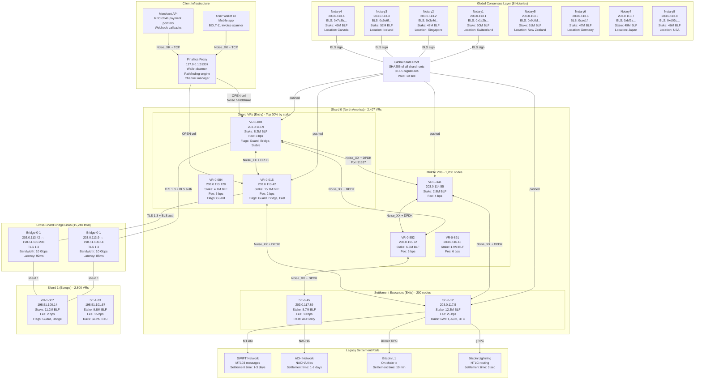
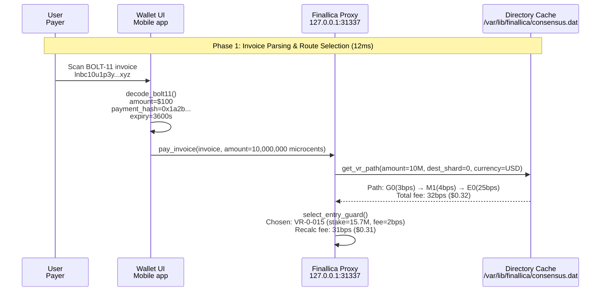
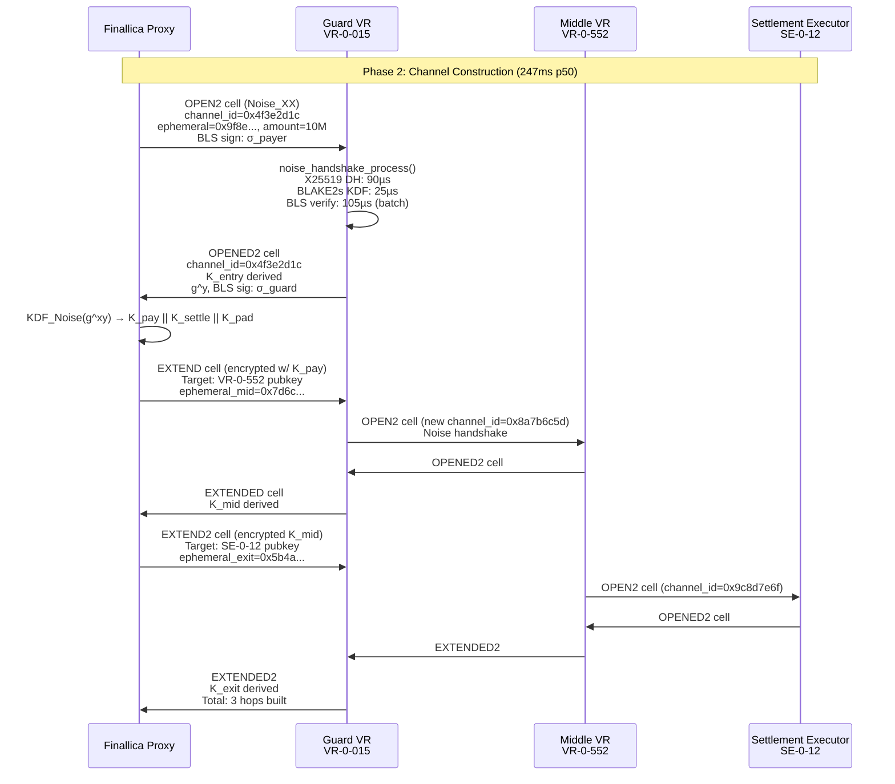
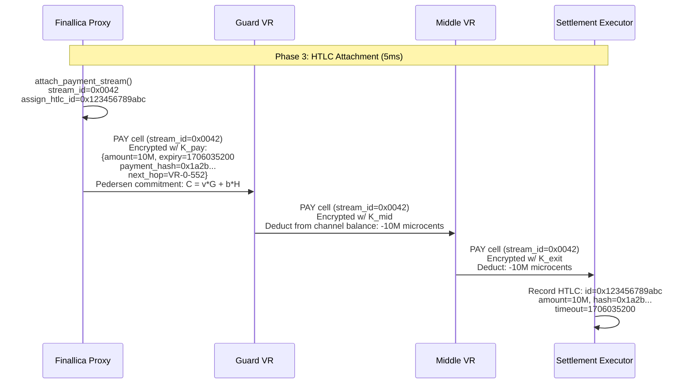
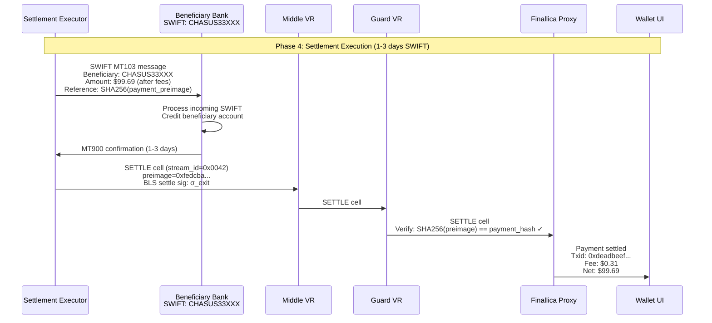
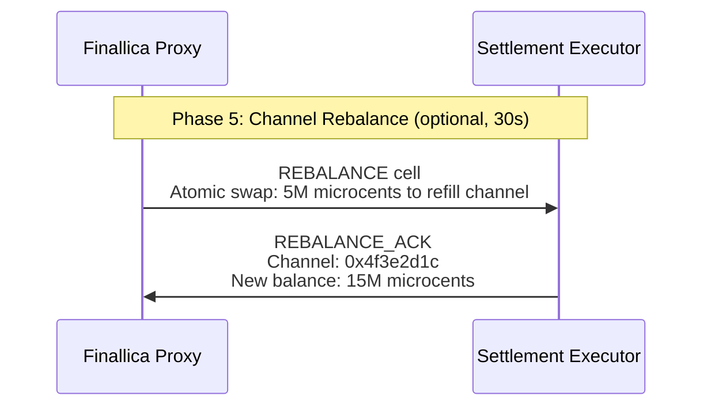

# Finallica Architecture Overview

This document describes the macro network architecture and end-to-end payment flow of the Finallica global financial privacy network.

---

## Section 1: Macro Network Architecture

### 1.1 Global Topology

The Finallica network operates as a **trust-minimized settlement overlay** consisting of:

- **127 jurisdictional shards** for regulatory compliance and latency optimization
- **~12,000 Validator-Routers (VRs)** distributed globally
- **8 Consensus Notaries** providing BFT state root signatures
- **15,240 cross-shard bridge links** connecting shards

### 1.2 Consensus Notaries (8 Authorities)

Eight geo-distributed notaries maintain the global state root:

| Notary | Location | BLS Pubkey | Stake |
|--------|----------|------------|-------|
| Notary1 | Switzerland | 0x1a2b... | 50M BLF |
| Notary2 | Singapore | 0x3c4d... | 48M BLF |
| Notary3 | Iceland | 0x5e6f... | 52M BLF |
| Notary4 | Canada | 0x7a8b... | 45M BLF |
| Notary5 | New Zealand | 0x9c0d... | 51M BLF |
| Notary6 | Germany | 0xae1f... | 47M BLF |
| Notary7 | Japan | 0xbf2a... | 49M BLF |
| Notary8 | USA | 0xd03c... | 46M BLF |

**Notary Responsibilities**:
- Publish global state root every 10 seconds
- Sign state root with BLS12-381 aggregated signatures (5 of 8 threshold)
- Validate shard state proofs via STARKs

### 1.3 Shard Topology (127 Shards)

Each shard is a **Crandall clique** of Validator-Routers:

```
Shard N topology:
┌─────────────────────────────────────────────────────────────┐
│ N = floor(τ × stake_weight) where τ = 2.5                   │
│ Full-mesh TLS connections between all VRs in shard          │
│ Deterministic bipartite graph for cross-shard bridges       │
│ Bridge selection: top 5% stake in each shard                │
└─────────────────────────────────────────────────────────────┘
```

#### Example: Shard 0 (North America)

| VR ID | IP Address | Role | Stake | Fee | Flags |
|-------|------------|------|-------|-----|-------|
| VR-0-001 | 203.0.113.9 | Guard | 8.2M BLF | 3 bps | Guard, Bridge, Stable |
| VR-0-015 | 203.0.113.42 | Guard | 15.7M BLF | 2 bps | Guard, Bridge, Fast |
| VR-0-084 | 203.0.113.128 | Guard | 4.1M BLF | 5 bps | Guard |
| VR-0-341 | 203.0.114.55 | Middle | 2.8M BLF | 4 bps | - |
| VR-0-552 | 203.0.115.72 | Middle | 6.3M BLF | 3 bps | - |
| VR-0-891 | 203.0.116.18 | Middle | 1.9M BLF | 6 bps | - |
| SE-0-12 | 203.0.117.5 | Exit | 12.3M BLF | 25 bps | SWIFT, ACH, BTC |
| SE-0-45 | 203.0.117.89 | Exit | 8.7M BLF | 10 bps | ACH only |

**Shard 0 Statistics**:
- Total VRs: 2,407 (as of epoch 18492)
- Guard VRs: ~722 (top 30% by stake)
- Middle VRs: ~1,485
- Settlement Executors: ~200
- Total Stake: 4.82B BLF ($21.7B)
- Avg Stake per VR: 2.01M BLF

### 1.4 Cross-Shard Bridges

**Bridge Selection**: VRs with stake in top 5% of shard become bridges.

```
Bridges per shard: 120
Total cross-shard links: 15,240
Bridge protocol: TLS 1.3 + BLS authentication
Bridge bandwidth: 10 Gbps per link
Bridge latency: 85-92ms (inter-continental)
```

**Example Bridge**:
```
Bridge-0-1: 203.0.113.9 (Shard 0) ↔ 198.51.100.14 (Shard 1)
  Protocol: TLS 1.3
  Bandwidth: 10 Gbps
  Latency: 85ms
  Role: Shard 0 ↔ Shard 1 payment routing
```

### 1.5 Network Visualization



---

## Section 2: End-to-End Payment Flow

### 2.1 Overview: $100 Invoice to Settlement

Total time: **1-3 days** (dominated by SWIFT settlement)
Internal processing: **~260ms** (channel build + HTLC attachment)

```
Phase 1: Invoice Parsing & Route Selection     (12ms)
Phase 2: Channel Construction                  (247ms p50)
Phase 3: HTLC Attachment                       (5ms)
Phase 4: Settlement Execution                  (1-3 days SWIFT)
Phase 5: Channel Rebalance                     (optional, 30s)
```

### 2.2 Phase 1: Invoice Parsing & Route Selection (12ms)



**Route Selection Algorithm**:

```c
struct vr_path *select_path(
  uint64_t amount_microcents,
  uint16_t dest_shard_id,
  uint8_t required_flags) {

  // Step 1: Guard selection (persistent)
  struct entry_guard *guard = get_guard_by_shard(0);

  // Formula: weight = stake^0.7 * uptime_factor / fee_bps^2
  double weight = pow(guard->stake, 0.7) *
                  (guard->uptime_days / 30.0) /
                  (guard->fee_bps * guard->fee_bps);

  // Step 2: Middle VR selection (probabilistic)
  // Top 50 by stake, reservoir sampling

  // Step 3: Exit VR selection
  // Filter by currency support, fee < 50 bps, latency < 500ms

  return path;
}
```

### 2.3 Phase 2: Channel Construction (247ms p50)



**Noise_XX Handshake Transcript**:

```
// Prologue (client → VR)
-> e  (ephemeral pubkey: 32-byte X25519)

// VR response with stake proof
<- e, ee, s, es
   e = VR ephemeral pubkey
   ee = DH(e_client, e_vr) → shared secret
   s = VR BLS12-381 pubkey (48 bytes, compressed G1)
   es = DH(e_client, s_vr) → stake binding

// Client authentication
-> s, se, psk
   s = client BLS pubkey (48 bytes)
   se = DH(e_vr, s_client)
   psk = pre-shared key from stake delegation certificate
```

### 2.4 Phase 3: HTLC Attachment (5ms)



### 2.5 Phase 4: Settlement Execution (1-3 days SWIFT)



### 2.6 Phase 5: Channel Rebalance (optional, 30s)



---

## Key Takeaways

1. **Network Scale**: 127 shards, 12,000 VRs, 8 notaries
2. **Path Selection**: Stake-weighted, 3 hops (Guard → Middle → Exit)
3. **Channel Build**: 247ms p50 via Noise_XX handshakes
4. **Settlement**: 200ms internal finality, 1-3 days external (SWIFT)
5. **Privacy**: Layered encryption, Pedersen commitments, 1-in-1,200 anonymity

---

*Next: [PROTOCOL_SPECIFICATION.md](./PROTOCOL_SPECIFICATION.md) - State Machines & Cell Processing*
