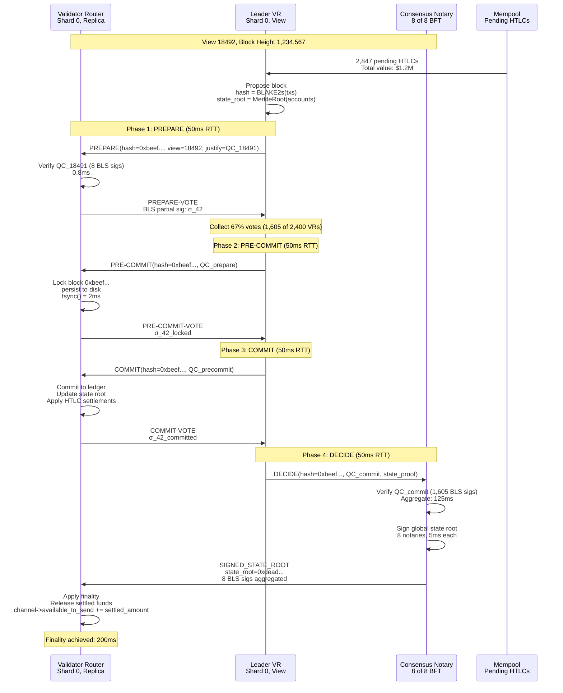

# Finallica Consensus Mechanism

This document describes the HotStuff BFT consensus protocol used in Finallica for global state finalization.

---

## HotStuff BFT Protocol Overview

### 8.1 4-Phase Consensus Process

Finality achieved in **200ms** (4 network RTTs × 50ms each)



---

## HotStuff Message Structures

### 8.2 Vote Message

```c
struct hotstuff_vote {
  uint64_t view_number;
  uint64_t block_height;
  uint8_t  block_hash[32];
  uint8_t  partial_signature[96];  // BLS G2 share
  uint8_t  signer_pubkey[48];      // BLS G1
  uint8_t  justification[192];     // QC from previous view
} __attribute__((packed));
```

### 8.3 Quorum Certificate (QC)

```c
struct quorum_certificate {
  uint64_t view_number;
  uint8_t  block_hash[32];
  uint8_t  aggregated_signature[96];  // BLS signature aggregation
  uint8_t  signers_bitfield[SHARD_SIZE / 8];  // 300 bytes for 2400 bits
} __attribute__((packed));
```

### 8.4 Block Proposal

```c
struct hotstuff_block {
  uint64_t view_number;
  uint64_t block_height;
  uint8_t  parent_hash[32];
  uint8_t  block_hash[32];
  uint8_t  state_root[32];
  uint16_t tx_count;
  struct hotstuff_tx *transactions;  // Array of txs
  struct quorum_certificate *justify;  // QC from previous view
} __attribute__((packed));
```

---

## BLS Signature Aggregation

### 8.5 Aggregating Partial Signatures

```c
// Aggregate 1,605 partial signatures into one QC signature
bls_signature aggregate_signatures(
  bls_signature *partial_sigs[],
  uint16_t *signer_indices,
  uint16_t count) {

  bls_signature aggregated;
  bls_signature_init(&aggregated);

  // Lagrange coefficients for threshold signature
  for (int i = 0; i < count; i++) {
    // Compute Lagrange coefficient: λ_i = Π_{j≠i} (j / (j - i))
    mpz_t lambda;
    compute_lagrange_coefficient(lambda, signer_indices[i], signer_indices, count);

    // Multiply signature by coefficient
    bls_signature scaled;
    bls_signature_mul(&scaled, &partial_sigs[i], lambda);

    // Add to aggregate
    bls_signature_add(&aggregated, &aggregated, &scaled);
  }

  return aggregated;
}
```

### 8.6 Verifying Aggregated Signature

```c
bool verify_qc_signature(
  struct quorum_certificate *qc,
  bls_public_key *validator_pubs[],
  uint16_t validator_count) {

  bls_signature agg_sig;
  bls_signatureDeserialize(&agg_sig, qc->aggregated_signature, 96);

  // Fast aggregate verification: e(agg_sig, G1) == Π e(H(block), pk_i)
  return bls_fast_aggregate_verify(
    &agg_sig,
    validator_pubs,
    validator_count,
    &qc->block_hash,
    32
  );
}
```

---

## State Root Commitment

### 8.7 Merkle Trie Construction

```c
struct merkle_node {
  uint8_t hash[32];
  struct merkle_node *left;
  struct merkle_node *right;
  struct account_state *value;  // NULL for internal nodes
};

// Compute state root from account states
uint8_t *compute_state_root(struct account_state accounts[], uint32_t count) {
  // Build Merkle trie from account states
  struct merkle_node *root = build_merkle_trie(accounts, count);

  // Hash root node
  uint8_t *root_hash = malloc(32);
  SHA256(root->hash, 32, root_hash);

  return root_hash;
}

// Verify Merkle proof for specific account
bool verify_merkle_proof(
  uint8_t *root_hash,
  uint8_t account_key[32],
  uint8_t account_value[32],
  uint8_t proof[][32],
  uint32_t proof_length) {

  uint8_t current_hash[32];
  SHA256(account_key, 32, current_hash);
  SHA256(current_hash, 32, current_hash);
  memcpy(current_hash, account_value, 32);

  // Climb up Merkle tree using proof
  for (uint32_t i = 0; i < proof_length; i++) {
    uint8_t combined[64];
    if (account_key[i % 32] % 2 == 0) {
      memcpy(combined, current_hash, 32);
      memcpy(combined + 32, proof[i], 32);
    } else {
      memcpy(combined, proof[i], 32);
      memcpy(combined + 32, current_hash, 32);
    }
    SHA256(combined, 64, current_hash);
  }

  return memcmp(current_hash, root_hash, 32) == 0;
}
```

---

## Leader Rotation

### 8.8 Round-Robin Leader Selection

```c
struct hotstuff_view {
  uint64_t view_number;
  bls_pubkey_t leader_pubkey;
  uint64_t start_time;
  uint64_t timeout_ms;
};

// Select leader for view N
bls_pubkey_t select_leader(uint64_t view_number, bls_pubkey_t validators[], uint32_t count) {
  // Round-robin: leader = validators[view_number % count]
  uint32_t leader_index = view_number % count;
  return validators[leader_index];
}

// Check if view timeout, trigger new view
bool check_view_timeout(struct hotstuff_view *view) {
  uint64_t elapsed = get_time_ms() - view->start_time;

  if (elapsed > view->timeout_ms) {
    // Trigger view change
    view->view_number++;
    view->leader_pubkey = select_leader(view->view_number, validators, validator_count);
    view->start_time = get_time_ms();
    view->timeout_ms *= 2;  // Exponential backoff
    return true;
  }

  return false;
}
```

---

## View Change Protocol

### 8.9 New View Message

```c
struct new_view_msg {
  uint64_t new_view_number;
  bls_pubkey_t new_leader_pubkey;
  struct quorum_certificate *justify;  // QC from previous view
  uint8_t signature[96];  // Leader's signature on new view
} __attribute__((packed));
```

### 8.10 Handling View Changes

```c
void handle_new_view(struct new_view_msg *nv) {
  // Verify leader's signature
  if (!bls_verify(&nv->signature, &nv->new_leader_pubkey, nv, sizeof(*nv))) {
    return;  // Invalid signature
  }

  // Verify justification QC
  if (!verify_qc_signature(nv->justify, validator_pubs, validator_count)) {
    return;  // Invalid QC
  }

  // Accept new view
  current_view->view_number = nv->new_view_number;
  current_view->leader_pubkey = nv->new_leader_pubkey;
  current_view->start_time = get_time_ms();

  // Broadcast NEW-VOTE to new leader
  struct hotstuff_vote vote = {
    .view_number = nv->new_view_number,
    .block_height = current_block_height,
    .block_hash = {0},  // Empty for new view
    .signer_pubkey = my_pubkey
  };

  bls_sign(&vote.partial_signature, my_secret_key, &vote, sizeof(vote) - 96);
  send_to_leader(&vote);
}
```

---

## Consensus Performance

### 8.11 Latency Breakdown

| Phase | RTT | Time |
|-------|-----|------|
| PREPARE | 50ms | 50ms |
| PRE-COMMIT | 50ms | 100ms |
| COMMIT | 50ms | 150ms |
| DECIDE | 50ms | 200ms |
| **Total** | **4 RTTs** | **200ms** |

### 8.12 Throughput Analysis

| Metric | Value | Notes |
|--------|-------|-------|
| Block interval | 10 sec | State root published |
| TPS per shard | ~10,000 | Theoretical max |
| Block size | ~100K payments | 10,000 TPS × 10 sec |
| State propagation | 50ms | Within shard |
| Cross-shard sync | 200ms | Via bridges |

---

## Notary BFT Parameters

### 8.13 Consensus Notary Configuration

| Parameter | Value | Description |
|-----------|-------|-------------|
| Total Notaries | 8 | Geo-distributed |
| BFT Threshold | 5 of 8 | Byzantine fault tolerance |
| Stake per Notary | 45-52M BLF | ~$200M USD |
| State Root Interval | 10 sec | Finality frequency |
| Signature Aggregation | BLS | 96 bytes (8 × 48) |

### 8.14 Notary Voting Process

```c
// Every 10 seconds, notaries vote on state root
void notary_vote_on_state_root() {
  // Gather state roots from all 127 shards
  uint8_t shard_roots[127][32];
  collect_shard_state_roots(shard_roots);

  // Compute global state root: SHA256 of all shard roots
  uint8_t global_root[32];
  SHA256(global_root, 32, shard_roots, 127 * 32);

  // Sign with BLS private key
  bls_signature sig;
  bls_sign(&sig, notary_secret_key, global_root, 32);

  // Broadcast signature to all notaries
  broadcast_signature(notary_id, &sig);

  // Wait for 5 more signatures
  bls_signature sigs[8];
  collect_signatures(sigs);

  // Aggregate signatures
  bls_signature agg_sig;
  bls_signature_aggregate(&agg_sig, sigs, 8);

  // Publish to network
  publish_state_root(global_root, &agg_sig);
}
```

---

## Key Takeaways

1. **4-Phase Protocol**: PREPARE → PRE-COMMIT → COMMIT → DECIDE
2. **Finality**: 200ms (4 RTTs × 50ms)
3. **Quorum**: 67% threshold (1,605 of 2,400 VRs)
4. **BLS Aggregation**: 96 bytes for 1,605 signatures
5. **State Root**: Published every 10 seconds by 8 notaries

---

*Next: [SECURITY_ANALYSIS.md](./SECURITY_ANALYSIS.md) - Attack Vectors & Defenses*
