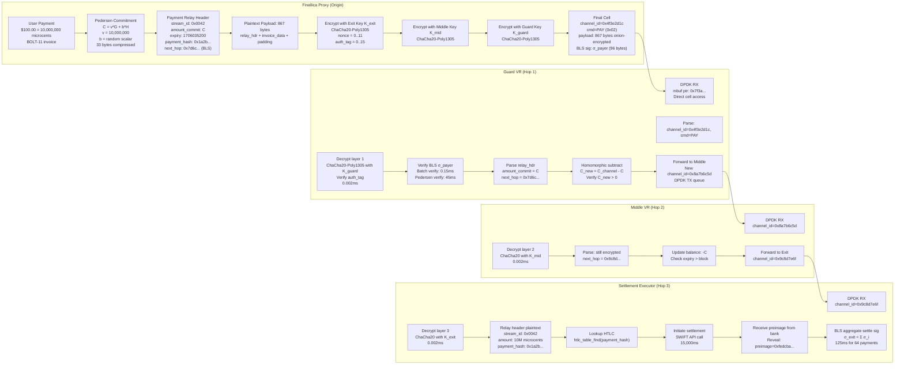

# Finallica Cryptographic Details

This document describes the payment cell flow, nested commitment unwrapping, and cryptographic primitives used in Finallica.

---

## Payment Cell Flow: Nested Commitment Unwrapping

### 6.1 Cell Structure & Encryption Layers

All Finallica payments use **3 layers of nested encryption** (one per hop):

```
Ciphertext = Encrypt_Guard(
  Encrypt_Middle(
    Encrypt_Exit(
      PaymentPayload + NextHopAddress + Amount
    )
  )
)
```

Each layer uses **ChaCha20-Poly1305** with independent keys derived via Noise_XX handshake.

### 6.2 Per-Hop Processing Diagram



---

## Pedersen Commitments

### 7.1 Commitment Scheme

**Pedersen commitments** hide payment amounts while allowing homomorphic operations:

```
C = v*G + b*H

where:
  C = commitment (33 bytes compressed)
  v = value (amount in microcents)
  G = secp256k1 generator point
  b = blinding factor (random scalar)
  H = second generator point (H = hash(G))
```

### 7.2 Commitment Creation

```c
secp256k1_pedersen_commitment commitment;
secp256k1_scalar blinding_factor;
secp256k1_scalar value;

// Set value
secp256k1_scalar_set_u64(&value, amount_microcents);

// Generate random blinding factor
randombytes_buf(&blinding_factor, 32);

// Create commitment
secp256k1_pedersen_commit(
  secp256k1_ctx,
  &commitment,
  &blinding_factor,
  amount_microcents,
  &secp256k1_generator_h
);

// Serialize to 33 bytes (compressed)
secp256k1_pedersen_commitment_serialize(
  &cell->commitment[0],
  &commitment
);
```

### 7.3 Homomorphic Operations

```c
// Subtract payment from channel balance
secp256k1_pedersen_commitment new_balance;
secp256k1_pedersen_commitment_negate(&payment_commit, &payment_commit);
secp256k1_pedersen_commitment_sum(
  &new_balance,
  (const secp256k1_pedersen_commitment *[]){
    &channel_balance,
    &payment_commit
  },
  2
);

// Verify balance is positive
bool is_positive = secp256k1_pedersen_commitment_verify_positive(&new_balance);
```

### 7.4 Range Proofs (Bulletproofs+)

To prevent negative amounts while keeping value hidden:

```c
// Generate range proof: 0 ≤ value < 2^64
secp256k1_bulletproofs_plus_proof bp_proof;
secp256k1_bulletproofs_plus_prove(
  secp256k1_ctx,
  &bp_proof,
  &commitment,
  &value,
  &blinding_factor,
  NULL,  // no additional commits
  0,     // n_additional_commits
  64,    // bit_range
  NULL   // custom_nonce
);

// Verification: 5-10ms (single), 0.5ms (batch 64)
bool valid = secp256k1_bulletproofs_plus_verify(
  secp256k1_ctx,
  &bp_proof,
  &commitment,
  NULL,
  0,
  64
);
```

---

## BLS12-381 Signatures

### 8.1 Key Generation

```c
bls_secret_key secret_key;
bls_public_key public_key;

// Generate
bls_bls_keygen(&secret_key, entropy, 32);

// Derive public key
bls_get_public_key(&public_key, &secret_key);

// Serialize (48 bytes compressed G1)
bls_public_key_serialize(&cell->bls_pubkey[0], &public_key);
```

### 8.2 Signing

```c
bls_signature signature;

// Sign commitment (33 bytes)
bls_sign(
  &signature,
  &secret_key,
  &cell->commitment[0],
  33,
  NULL  // no proof of possession
);

// Serialize (96 bytes G2)
bls_signature_serialize(&cell->bls_signature[0], &signature);
```

### 8.3 Verification (Single)

```c
bls_signature sig;
bls_public_key pk;
bls_signatureDeserialize(&sig, &cell->bls_signature[0], 96);
bls_public_keyDeserialize(&pk, &cell->bls_pubkey[0], 48);

bool valid = bls_verify(
  &sig,
  &pk,
  &cell->commitment[0],
  33
);
// Time: ~2-3ms (single)
```

### 8.4 Batch Verification

```c
// Aggregate 64 signatures for verification
bls_signature agg_sig;
bls_signature_aggregate(&agg_sig, signatures, 64);

// Verify all at once
bool valid = bls_fast_aggregate_verify(
  &agg_sig,
  public_keys,
  64,
  messages,
  message_lengths
);
// Time: ~0.15ms for 64 signatures (40x faster)
```

### 8.5 Signature Aggregation

Used by Exit VRs to aggregate settlement signatures:

```c
// Combine 64 payment signatures
bls_signature aggregated;
bls_signature_aggregate(&aggregated, settle_sigs, 64);

// Broadcast aggregated signature to notaries
bls_signature_serialize(&agg_sig_bytes[0], &aggregated);
```

---

## ChaCha20-Poly1305 Encryption

### 9.1 Key Derivation

```c
uint8_t chaining_key[32];
uint8_t pay_key[32];
uint8_t nonce[12];

// Extract phase
BLAKE2s(chaining_key, 32, NULL, 0,
        handshake_hash, BLAKE2S_OUTBYTES,
        "FinallicaExtract", 16);

// Expand phase (3 keys)
HKDF_BLAKE2s_Expand(pay_key, 32, chaining_key, 32,
                    "FinallicaPayKey", 15);
HKDF_BLAKE2s_Expand(settle_key, 32, chaining_key, 32,
                    "FinallicaSettleKey", 18);
HKDF_BLAKE2s_Expand(padding_key, 32, chaining_key, 32,
                    "FinallicaPaddingKey", 17);

// Initialize cipher
crypto_aead_chacha20poly1305_ietf_keygen(cipher_state, pay_key);
```

### 9.2 Encryption (Per Hop)

```c
// Nonce: 12-byte counter (incremented per cell)
uint64_t *nonce_counter = (uint64_t *)nonce;
*nonce_counter = cell_sequence;

// Encrypt payload
crypto_aead_chacha20poly1305_ietf_encrypt(
  cell->payload,        // ciphertext output
  &cell->payload_len,   // ciphertext length
  plaintext,            // plaintext input
  plaintext_len,        // plaintext length
  NULL,                 // additional data
  0,                    // AD length
  NULL,                 // nonce (set separately)
  cipher->key           // key
);

// Set nonce explicitly
memcpy(cell->nonce, nonce, 12);
```

### 9.3 Decryption (Per Hop)

```c
uint8_t plaintext[867];
size_t plaintext_len;

int result = crypto_aead_chacha20poly1305_ietf_decrypt(
  plaintext,              // plaintext output
  &plaintext_len,         // plaintext length
  NULL,                   // unused
  cell->payload,          // ciphertext
  cell->payload_len,      // ciphertext length
  cell->auth_tag,         // auth tag (16 bytes)
  cell->nonce,            // nonce (12 bytes)
  cipher->key             // key
);

if (result != 0) {
  // Authentication failed - reject cell
  channel_penalty(channel_id, 100);
  return;
}
```

---

## Key Rotation Schedule

| Key Type | Rotation Trigger | Max Lifetime |
|----------|-----------------|--------------|
| K_pay (Pay Cipher) | 2^20 cells OR 1 hour | ~1M cells |
| K_settle (Settle Cipher) | 2^20 cells OR 1 hour | ~1M cells |
| K_pad (Padding Cipher) | 1 hour (fixed) | 1 hour |
| Rekey Key | 6 hours | 6 hours |

**Rekeying Process** (in-band, zero-RTT):

```c
struct rekey_cell {
  uint8_t command: 0xFF;  // REKEY
  uint32_t channel_id;
  uint8_t new_ephemeral[32];  // X25519
  uint8_t signature[64];       // Ed25519(new_ephemeral || old_key || channel_id)
  uint8_t auth_tag[16];        // Poly1305
} __attribute__((packed));
```

---

## Cryptographic Performance

| Operation | Time (single) | Time (batch 64) |
|-----------|---------------|-----------------|
| ChaCha20-Poly1305 encrypt | 1.2 µs | N/A |
| ChaCha20-Poly1305 decrypt | 1.2 µs | N/A |
| BLS sign | 2-3 ms | N/A |
| BLS verify (single) | 2-3 ms | N/A |
| BLS verify (batch 64) | N/A | 0.15 ms |
| BLS aggregate (64) | 0.125 ms | N/A |
| Pedersen commit | 45 µs | N/A |
| Bulletproofs+ prove | 780 µs | N/A |
| Bulletproofs+ verify | 5-10 ms | 0.5 ms |
| X25519 scalar mult | 90 µs | N/A |
| BLAKE2s hash | 25 µs | N/A |

---

## Key Takeaways

1. **Nested Encryption**: 3 layers (Guard → Middle → Exit)
2. **Amount Hiding**: Pedersen commitments + Bulletproofs+ range proofs
3. **Stake Binding**: BLS12-381 signatures (batch verification 40x faster)
4. **Fast Symmetric**: ChaCha20-Poly1305 (1.2 µs per hop)
5. **Key Rotation**: Every 1M cells or 1 hour (whichever first)

---

*Next: [LIQUIDITY_MANAGEMENT.md](./LIQUIDITY_MANAGEMENT.md) - Flow Control & Channel Windows*
