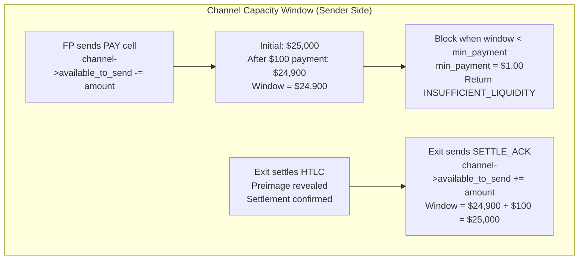
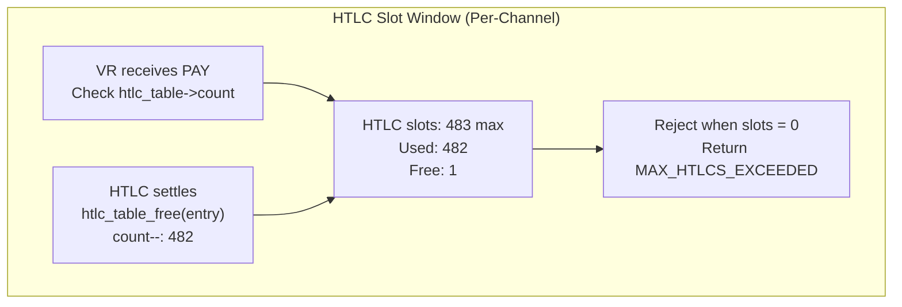
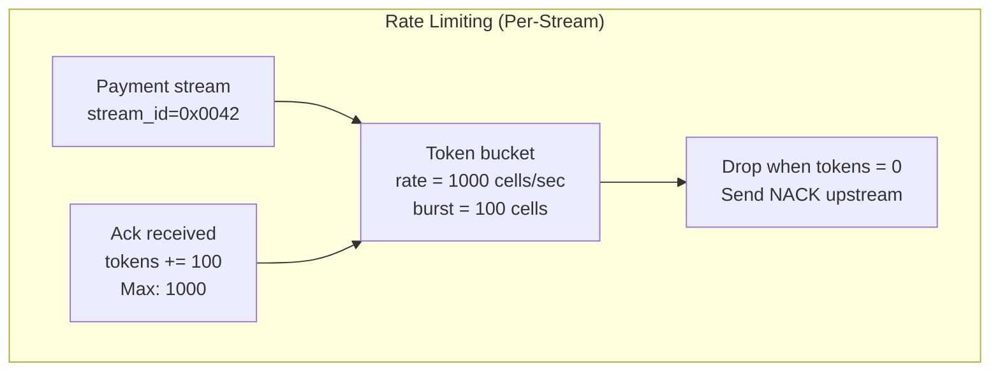
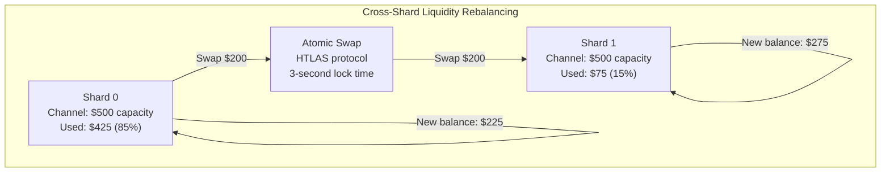

# Finallica Liquidity Management

This document describes the flow control mechanisms, channel windows, and liquidity rebalancing in Finallica.

---

## Channel Capacity Windows

### 7.1 Sender-Side Flow Control



### Channel Window Structure

```c
struct channel_window {
  int64_t available_to_send;   // Payer's liquidity (microcents)
  int64_t available_to_recv;   // Payee's settlement capacity
  uint32_t max_inflight_htlcs; // Default: 483 (BOLT-03 limit)
  uint64_t min_payment;        // $1.00 = 100,000 microcents
};

// Default initialization
struct channel_window default_window = {
  .available_to_send = 25000000,    // $25,000
  .available_to_recv = 25000000,
  .max_inflight_htlcs = 483,
  .min_payment = 100000
};
```

### Window Update Logic

```c
// When sending payment
bool can_send_payment(struct channel *chan, uint64_t amount) {
  if (chan->window.available_to_send < amount + chan->window.min_payment) {
    return false;  // Would drop below minimum
  }
  if (chan->htlc_count >= chan->window.max_inflight_htlcs) {
    return false;  // Too many inflight HTLCs
  }
  return true;
}

// Deduct from window
void deduct_from_window(struct channel *chan, uint64_t amount) {
  chan->window.available_to_send -= amount;
  chan->htlc_count++;
}

// Refund on settlement
void refund_window(struct channel *chan, uint64_t amount) {
  chan->window.available_to_send += amount;
  chan->htlc_count--;
}
```

---

## HTLC Slot Windows

### 7.2 Per-Channel HTLC Limits



### HTLC Table Management

```c
#define HTLC_MAX_PER_CHANNEL 483

struct htlc_table {
  htlc_entry_t *entries[HTLC_MAX_PER_CHANNEL];
  uint16_t count;
  bitarray_t *used_slots;  // 483 bits
};

// Allocate HTLC slot
htlc_entry_t *htlc_allocate(struct htlc_table *table) {
  if (table->count >= HTLC_MAX_PER_CHANNEL) {
    return NULL;  // Table full
  }

  // Find free slot
  for (int i = 0; i < HTLC_MAX_PER_CHANNEL; i++) {
    if (!bitarray_test(table->used_slots, i)) {
      bitarray_set(table->used_slots, i);
      table->entries[i] = calloc(1, sizeof(htlc_entry_t));
      table->count++;
      return table->entries[i];
    }
  }

  return NULL;
}

// Free HTLC slot
void htlc_free(struct htlc_table *table, htlc_entry_t *entry) {
  int index = entry->index;
  bitarray_clear(table->used_slots, index);
  free(table->entries[index]);
  table->entries[index] = NULL;
  table->count--;
}
```

---

## Rate Limiting (Per-Stream)

### 7.3 Token Bucket Rate Limiter



### Token Bucket Implementation

```c
struct token_bucket {
  uint64_t rate;         // tokens per second
  uint64_t burst;        // max tokens
  uint64_t tokens;       // current tokens
  uint64_t last_update;  // timestamp (µs)
};

// Check if tokens available
bool token_bucket_consume(struct token_bucket *bucket, uint64_t tokens) {
  uint64_t now = get_time_us();
  uint64_t elapsed = now - bucket->last_update;

  // Refill based on elapsed time
  bucket->tokens += (elapsed * bucket->rate) / 1000000;
  if (bucket->tokens > bucket->burst) {
    bucket->tokens = bucket->burst;
  }
  bucket->last_update = now;

  // Check if enough tokens
  if (bucket->tokens < tokens) {
    return false;  // Rate limited
  }

  bucket->tokens -= tokens;
  return true;
}

// Add tokens on ACK
void token_bucket_add(struct token_bucket *bucket, uint64_t tokens) {
  bucket->tokens += tokens;
  if (bucket->tokens > bucket->burst) {
    bucket->tokens = bucket->burst;
  }
}
```

### Rate Limits by Stream Type

| Stream Type | Rate | Burst |
|-------------|------|-------|
| Normal payments | 1,000 cells/sec | 100 cells |
| High-priority | 5,000 cells/sec | 500 cells |
| Settlement | 10,000 cells/sec | 1,000 cells |
| Padding | 1 cell/sec | 10 cells |

---

## Cross-Shard Liquidity Rebalancing

### 7.4 Atomic Swap Protocol



### HTLAS (Hashed Timelock Atomic Swap) Protocol

```c
struct htlas_swap {
  uint64_t amount;
  uint8_t payment_hash[32];
  uint32_t timeout_block;  // 3 seconds = ~15 blocks
  bls_pubkey_t shard_a_pubkey;
  bls_pubkey_t shard_b_pubkey;
};

// Step 1: Shard A creates HTLC
bool shard_a_create_htlc(struct htlas_swap *swap) {
  // Lock funds on Shard A
  htlc_entry_t *htlc = htlc_allocate(&shard_a->htlc_table);
  htlc->amount = swap->amount;
  htlc->payment_hash = swap->payment_hash;
  htlc->expiry = current_block + swap->timeout_block;

  // Broadcast to Shard B via bridge
  bridge_send_htlc(swap);
  return true;
}

// Step 2: Shard B creates mirrored HTLC
bool shard_b_create_htlc(struct htlas_swap *swap) {
  // Lock funds on Shard B (refundable if timeout)
  htlc_entry_t *htlc = htlc_allocate(&shard_b->htlc_table);
  htlc->amount = swap->amount;
  htlc->payment_hash = swap->payment_hash;
  htlc->expiry = current_block + swap->timeout_block;
  return true;
}

// Step 3: Reveal preimage, claim both HTLCs
bool claim_htlc(struct htlas_swap *swap, uint8_t *preimage) {
  // Verify preimage matches hash
  if (SHA256(preimage) != swap->payment_hash) {
    return false;
  }

  // Claim on Shard A
  shard_a_claim_htlc(swap, preimage);

  // Claim on Shard B
  shard_b_claim_htlc(swap, preimage);

  return true;
}

// Step 4: Refund if timeout
bool refund_htlc(struct htlas_swap *swap) {
  if (current_block < swap->timeout_block) {
    return false;  // Not yet expired
  }

  // Refund both HTLCs
  shard_a_refund_htlc(swap);
  shard_b_refund_htlc(swap);
  return true;
}
```

### Rebalancing Trigger Conditions

| Condition | Threshold | Action |
|-----------|-----------|--------|
| High utilization | >85% capacity | Rebalance OUT |
| Low utilization | <15% capacity | Rebalance IN |
| Rebalance amount | Min $50, Max $500 | Atomic swap |
| Lock time | 3 seconds (15 blocks) | HTLAS timeout |

---

## Liquidity Fee Structure

### 7.5 Dynamic Fee Calculation

Fees increase with channel utilization:

```c
uint64_t calculate_liquidity_fee(
  uint64_t amount,
  struct channel *chan) {

  double utilization = (double)chan->used / chan->capacity;

  // Fee multiplier: 1.0x at 0%, 1.5x at 85%, 2.5x at 95%
  double multiplier = 1.0 + pow(utilization / 0.9, 4);

  // Base rate: 2 bps
  uint64_t fee = amount * 0.0002 * multiplier;

  return fee;
}
```

### Fee Examples

| Utilization | Multiplier | Fee on $100 |
|-------------|------------|-------------|
| 0% | 1.0x | $0.02 |
| 50% | 1.1x | $0.022 |
| 85% | 1.5x | $0.03 |
| 90% | 1.8x | $0.036 |
| 95% | 2.7x | $0.054 |

---

## Channel Rebalance Threshold

```c
#define REBALANCE_THRESHOLD_HIGH 0.85  // 85%
#define REBALANCE_THRESHOLD_LOW  0.15  // 15%
#define REBALANCE_MIN_AMOUNT    50000000  // $50
#define REBALANCE_MAX_AMOUNT    500000000 // $500

void check_rebalance_needed(struct channel *chan) {
  double utilization = (double)chan->used / chan->capacity;

  if (utilization > REBALANCE_THRESHOLD_HIGH) {
    // Need to rebalance OUT
    uint64_t amount = (chan->used - (chan->capacity * 0.6));
    amount = MAX(amount, REBALANCE_MIN_AMOUNT);
    amount = MIN(amount, REBALANCE_MAX_AMOUNT);

    initiate_rebalance(chan, amount, REBALANCE_OUT);
  }
  else if (utilization < REBALANCE_THRESHOLD_LOW) {
    // Need to rebalance IN
    uint64_t amount = ((chan->capacity * 0.4) - chan->used);
    amount = MAX(amount, REBALANCE_MIN_AMOUNT);
    amount = MIN(amount, REBALANCE_MAX_AMOUNT);

    initiate_rebalance(chan, amount, REBALANCE_IN);
  }
}
```

---

## Key Takeaways

1. **Channel Windows**: $25,000 default capacity, 483 HTLC slots max
2. **Rate Limiting**: Token bucket, 1,000 cells/sec per stream
3. **Rebalancing**: Atomic swaps at 85%/15% thresholds
4. **Dynamic Fees**: Increase with utilization (1x → 2.7x)
5. **HTLAS Protocol**: 3-second lock time for cross-shard swaps

---

*Next: [CONSENSUS_MECHANISM.md](./CONSENSUS_MECHANISM.md) - HotStuff BFT Protocol*
