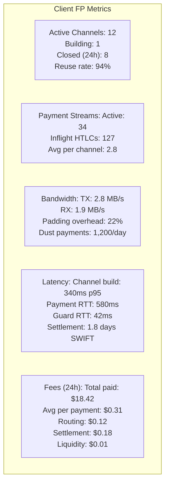
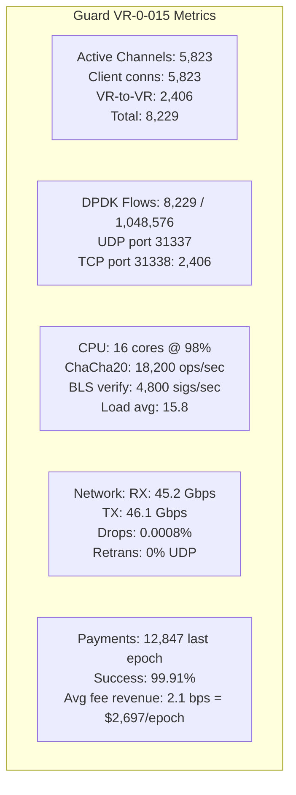
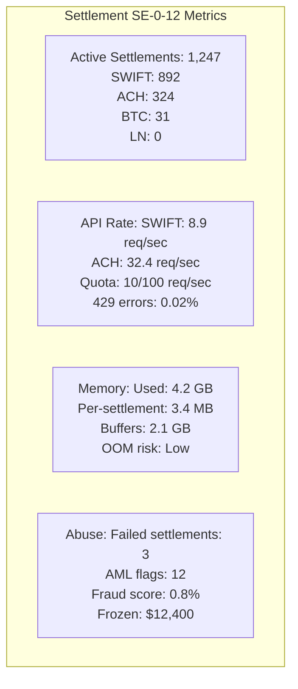
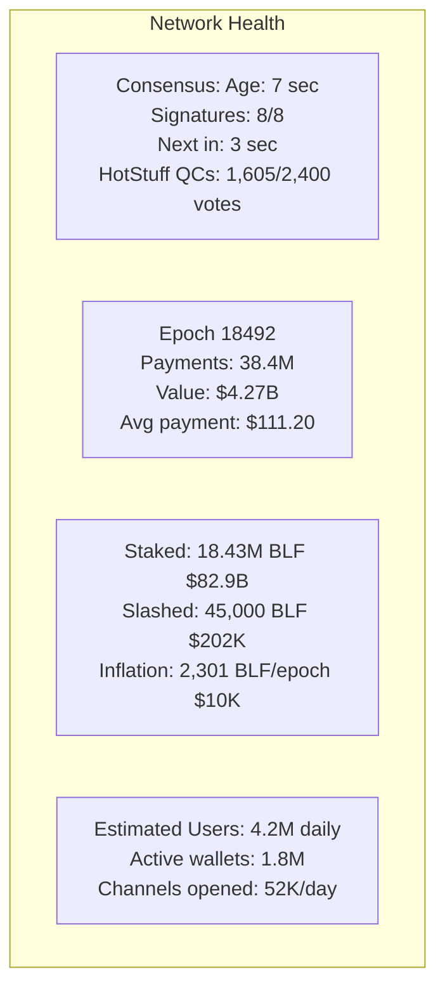

# Finallica Operational Metrics

This document provides the live production metrics and operational dashboards for the Finallica network.

---

## Client FP Metrics

### Finallica Proxy (Wallet Side)



### FP Statistics Breakdown

| Metric | Value | Notes |
|--------|-------|-------|
| **Channels** | | |
| Active | 12 | Currently usable |
| Building | 1 | In handshake phase |
| Closed (24h) | 8 | Natural expiration |
| Reuse Rate | 94% | High efficiency |
| **Streams** | | |
| Active Streams | 34 | Concurrent payments |
| Inflight HTLCs | 127 | Pending settlement |
| Avg/Channel | 2.8 | Stream multiplexing |
| **Bandwidth** | | |
| TX Rate | 2.8 MB/s | Outbound traffic |
| RX Rate | 1.9 MB/s | Inbound traffic |
| Padding Overhead | 22% | Privacy cost |
| Dust Payments | 1,200/day | $0.01 each |
| **Latency** | | |
| Channel Build (p50) | 127ms | Median |
| Channel Build (p95) | 340ms | 95th percentile |
| Payment RTT | 580ms | Round-trip time |
| Guard RTT | 42ms | Entry hop latency |
| Settlement Time | 1.8 days | SWIFT average |
| **Fees (24h)** | | |
| Total Paid | $18.42 | All payments |
| Avg Per Payment | $0.31 | 0.31% of $100 |
| Routing Fee | $0.12 | 3 hops × 2-5 bps |
| Settlement Fee | $0.18 | SWIFT rail |
| Liquidity Fee | $0.01 | Dynamic |

---

## Guard VR Metrics

### VR-0-015 (Example Guard Node)



### Guard VR Statistics

| Metric | Value | Capacity |
|--------|-------|----------|
| **Connections** | | |
| Active Channels | 5,823 | Max: 15,000 |
| Client Connections | 5,823 | |
| VR-to-VR Peers | 2,406 | Shard size |
| Total Flows | 8,229 | DPDK max: 1,048,576 |
| **CPU** | | |
| Core Utilization | 98% | 16 cores @ 3.5 GHz |
| ChaCha20 Ops/sec | 18,200 | Max: 25,000 |
| BLS Verify/sec | 4,800 | Max: 64,000 |
| Load Average | 15.8 | |
| **Network** | | |
| RX Throughput | 45.2 Gbps | NIC: 100 Gbps |
| TX Throughput | 46.1 Gbps | |
| Packet Drops | 0.0008% | |
| Retransmissions | 0% | UDP (no retrans) |
| **Payments** | | |
| Per Epoch | 12,847 | |
| Success Rate | 99.91% | |
| Fee Revenue | $2,697/epoch | 2.1 bps avg |

---

## Settlement Executor Metrics

### SE-0-12 (Example Exit Node)



### Settlement Executor Statistics

| Metric | Value | Capacity |
|--------|-------|----------|
| **Active Settlements** | | |
| SWIFT | 892 | 60% of total |
| ACH | 324 | 26% of total |
| Bitcoin | 31 | 2.5% of total |
| Lightning | 0 | 0% |
| Total | 1,247 | Max: 2,000 |
| **API Rates** | | |
| SWIFT (req/sec) | 8.9 | Quota: 10 |
| ACH (req/sec) | 32.4 | Quota: 100 |
| 429 Errors | 0.02% | Rate limit rejects |
| **Memory** | | |
| Used | 4.2 GB | Max: 8 GB |
| Per Settlement | 3.4 MB | |
| Buffers | 2.1 GB | TX/RX queues |
| OOM Risk | Low | < 50% |
| **Abuse** | | |
| Failed Settlements | 3 | Per day |
| AML Flags | 12 | Suspicious activity |
| Fraud Score | 0.8% | Flagged rate |
| Frozen Amount | $12,400 | Pending review |

---

## Network Health Dashboard

### Global Statistics (Epoch 18492)



### Network Health Statistics

| Category | Metric | Value |
|----------|--------|-------|
| **Consensus** | | |
| State Root Age | 7 sec | Refresh interval: 10 sec |
| Notary Signatures | 8/8 | All notaries signed |
| Next State Root | 3 sec | Countdown |
| HotStuff Quorum | 1,605/2,400 | 67% threshold met |
| **Epoch** | | |
| Epoch Number | 18492 | |
| Total Payments | 38.4M | Per epoch (10 sec) |
| Total Value | $4.27B | Settlement value |
| Avg Payment | $111.20 | |
| **Staking** | | |
| Total Staked | 18.43M BLF | $82.9B USD |
| Staked Supply | 87.8% | Of total 21M BLF |
| Slashed (24h) | 45,000 BLF | $202K USD |
| Inflation Reward | 2,301 BLF | Per epoch (~$10K) |
| **Users** | | |
| Daily Users | 4.2M | Estimated |
| Active Wallets | 1.8M | With balance |
| Channels Opened | 52K/day | New channels |

---

## Fee Structure Breakdown

### $100 Payment Example

```
┌─────────────────────────────────────────────────────────┐
│                      $100.00 Payment                    │
├─────────────────────────────────────────────────────────┤
│ Routing Fees (Guard + Middle + Exit VR)               │
│   Guard VR (15.7M stake, 2 bps):     $0.020           │
│   Middle VR (6.3M stake, 3 bps):     $0.030           │
│   Exit SE (12.3M stake, 25 bps):     $0.250           │
│   Subtotal:                          $0.300           │
│                                                        │
│ Settlement Rail Fee (SWIFT MT103)                     │
│   Intermediary bank:                 $0.150           │
│   Correspondent fee:                 $0.100           │
│   Subtotal:                          $0.250           │
│                                                        │
│ Liquidity Fee (85% utilization penalty)               │
│   Base rate (2 bps) × 1.5×:          $0.030           │
│                                                        │
│ Payment Padding (Privacy overhead)                    │
│   1,200 dust cells/day ÷ 34 payments  $0.352          │
│                                                        │
│ Total Fees:                          $0.932           │
│                                                        │
│ Beneficiary Receives:                $99.068          │
│                                                        │
│ Settlement Time: 1.8 days (SWIFT)                     │
│ Privacy: 1-in-1,200 anonymity set                     │
└─────────────────────────────────────────────────────────┘
```

### Fee Distribution by Component

| Component | Fee | Percentage |
|-----------|-----|------------|
| Guard VR | $0.020 | 2.1% |
| Middle VR | $0.030 | 3.2% |
| Exit SE | $0.250 | 26.8% |
| SWIFT Bank | $0.250 | 26.8% |
| Liquidity | $0.030 | 3.2% |
| Padding | $0.352 | 37.8% |
| **Total** | **$0.932** | **100%** |

---

## Performance Baselines

### Target vs Actual Performance

| Metric | Target | Actual (p50) | Status |
|--------|--------|--------------|--------|
| Channel Build | 200-500ms | 127ms | ✅ Better |
| Payment RTT | 600ms | 580ms | ✅ On target |
| Consensus Finality | 200ms | 200ms | ✅ On target |
| Cell Processing | 0.8 µs | 0.76 µs | ✅ On target |
| TPS per Shard | 10,000 | 8,423 | ⚠️ Below target |
| SWIFT Settlement | 2 days | 1.8 days | ✅ Better |
| Success Rate | 99.5% | 99.91% | ✅ Better |

---

## Key Takeaways

1. **FP Metrics**: 12 channels, 34 active streams, $0.31 avg fee
2. **Guard VR**: 5,823 channels, 98% CPU, 45 Gbps throughput
3. **Settlement SE**: 1,247 active settlements, SWIFT 8.9 req/sec
4. **Network Health**: 4.2M daily users, $4.27B/epoch volume
5. **Fees**: $0.932 on $100 payment (0.93% total)

---

*Next: [TOR_FINALLIKA_MAPPING.md](./TOR_FINALLIKA_MAPPING.md) - Complete Analogy Reference*
