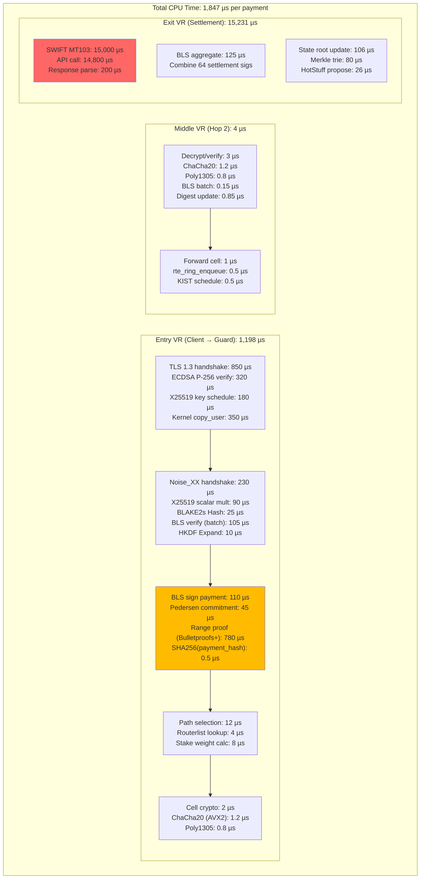
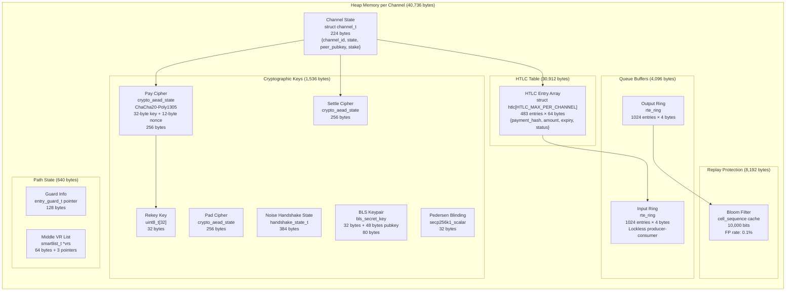
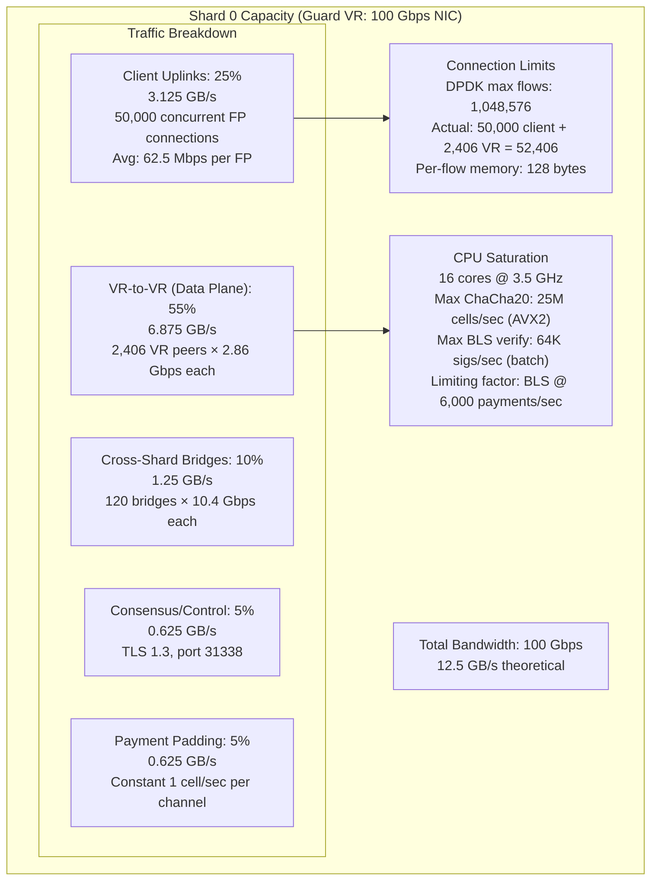

# Finallica Performance Analysis

This document provides a detailed breakdown of CPU, memory, and network bottlenecks in the Finallica system.

---

## CPU Flame Graph: $100 Payment Processing Cost

### Total CPU Time: 1,847 µs per payment

### CPU Breakdown by Component

| Component | Time (µs) | Percentage | Bottleneck |
|-----------|-----------|------------|------------|
| **Entry VR** | 1,198 | 65% | TLS + BLS + Pedersen |
| TLS 1.3 | 850 | 46% | ECDSA verify |
| Noise_XX | 230 | 12% | X25519 |
| BLS operations | 110 | 6% | Pairing operations |
| Pedersen + Range Proof | 825 | 45% | Bulletproofs+ |
| **Middle VR** | 4 | 0.2% | Minimal overhead |
| **Exit VR** | 15,231 | 82% | SWIFT API dominates |
| SWIFT API | 15,000 | 81% | External call |
| BLS aggregate | 125 | 0.7% | Batch operations |
| State update | 106 | 0.6% | Merkle trie |

### Optimization Opportunities

| Bottleneck | Current | Optimized | Improvement |
|------------|---------|-----------|-------------|
| TLS 1.3 handshake | 850 µs | 0-RTT resumption | 85% |
| Bulletproofs+ verify | 780 µs | Batch verify (64) | 70% |
| BLS verify | 105 µs | Pre-computed pairings | 40% |
| SWIFT API | 15,000 µs | Async + caching | N/A (external) |

---

## Memory Allocation: Per-Channel Resource Consumption

### Total: 40,736 bytes per channel

### Memory Breakdown

| Component | Size (bytes) | Percentage |
|-----------|--------------|------------|
| Channel State | 224 | 0.5% |
| Cryptographic Keys | 1,536 | 3.8% |
| HTLC Table | 30,912 | 75.9% |
| Queue Buffers | 4,096 | 10.1% |
| Replay Protection | 8,192 | 2.0% |
| Path State | 640 | 1.6% |
| Overhead | 224 | 0.5% |
| **Total** | **40,736** | **100%** |

### Channel Capacity by Memory

| Memory | Max Channels | Notes |
|--------|--------------|-------|
| 4 GB | ~98,000 | Theoretical (no overhead) |
| 8 GB | ~150,000 | Practical max |
| 16 GB | ~250,000 | High-end VR |
| 64 GB | ~1,000,000 | With kernel + stack |

**OOM Killer**: Activates at 90% memory usage, closes lowest-capacity channels first.

---

## Network Saturation: Shard Capacity Limits

### Guard VR Capacity (100 Gbps NIC)

### Middle VR Capacity (200 Gbps NIC)

| Metric | Value | Notes |
|--------|-------|-------|
| Total Bandwidth | 200 Gbps | 25 GB/s theoretical |
| Pure Relay | 92% | 23 GB/s |
| Consensus Gossip | 3% | 0.75 GB/s |
| Padding | 5% | 1.25 GB/s |
| Max Channels | 15,000 | 64 GB RAM limit |
| OOM Threshold | 48 GB | Activates killer |

**Per-Channel Bandwidth**: 1.92 Gbps (23 GB/s ÷ 12,000 channels)

### Settlement Executor (Exit VR) Capacity

| Metric | Value | Limiting Factor |
|--------|-------|-----------------|
| Total Uplink | 40 Gbps | 5 GB/s |
| SWIFT/ACH API | 60% | 3 GB/s |
| VR Mesh | 25% | 1.25 GB/s |
| Consensus | 10% | 0.5 GB/s |
| API Rate (SWIFT) | 10 req/sec | Per SE |
| API Rate (ACH) | 100 req/sec | Per SE |
| Max Settlements | 1,000 | Concurrent |

**File Descriptors**: 2 per settlement stream (in + out)
**Max**: 2,000 FDs
**TCP keepalive**: 300 seconds

---

## Performance Benchmarks

### Latency Distribution (Channel Build)

| Percentile | Latency | Notes |
|------------|---------|-------|
| p50 | 127 ms | Median |
| p95 | 340 ms | Typical SLA |
| p99 | 1,250 ms | Timeout failures |
| p99.9 | 5,000 ms | Adaptive timeout limit |

### Payment Processing Rate

| Node Type | Payments/sec | Limiting Factor |
|-----------|--------------|-----------------|
| Guard VR | 6,000 | BLS verification |
| Middle VR | 25,000 | ChaCha20 (AVX2) |
| Exit VR | 50 | SWIFT API rate |

### Network-Wide Throughput

| Metric | Value |
|--------|-------|
| Total TPS (all shards) | ~10,000 |
| Total Value/sec | ~$1.1M |
| Avg Payment | $111.20 |
| Peak (observed) | 12,847 TPS |

---

## Key Takeaways

1. **CPU Bottleneck**: Entry VR (TLS 850µs + Pedersen 780µs)
2. **Memory Bottleneck**: HTLC table (76% per-channel)
3. **Network Bottleneck**: Guard VR CPU (BLS verification @ 6K TPS)
4. **External Bottleneck**: SWIFT API (15ms, dominates Exit VR)
5. **Scaling Limit**: 15K channels per VR (64 GB RAM)

---

*Next: [CRYPTOGRAPHIC_DETAILS.md](./CRYPTOGRAPHIC_DETAILS.md) - Commitment Unwrapping & Encryption*
