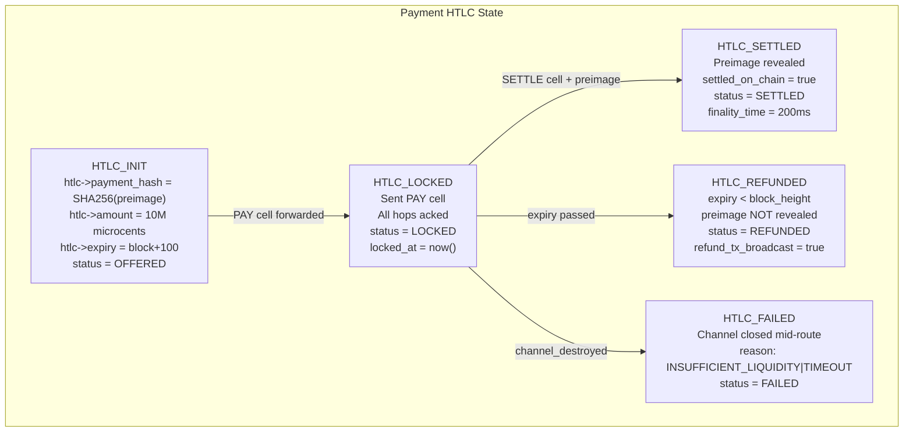
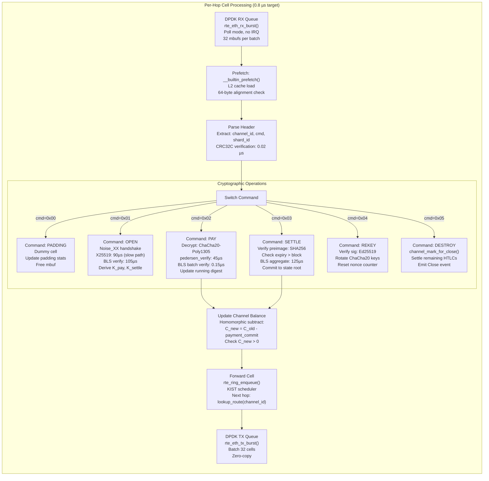

# Finallica Protocol Specification

This document describes the state machines and cell processing pipeline of the Finallica network.

---

## Section 3: State Machines

### 3.1 Channel Lifecycle State Machine

```mermaid
graph TB
    subgraph "Channel Lifecycle"
        C_INIT["INIT<br/>channel->state = CHANNEL_BUILDING<br/>channel->n_hops = 0<br/>local_balance = capacity<br/>remote_balance = 0"]
        C_G_WAIT["GUARD_WAIT<br/>awaiting OPENED<br/>channel->n_hop_build = 1<br/>noise_hs_state = 'e, ee, s, es'"]
        C_M_WAIT["MID_WAIT<br/>awaiting EXTENDED<br/>channel->n_hop_build = 2<br/>K_pay derived"]
        C_OPEN["OPEN<br/>channel->state = CHANNEL_OPEN<br/>n_hops = 3<br/>valid_for = 21600 sec (6h)<br/>cells_sent = 0<br/>last_rekey = now()"]
        C_ACTIVE["ACTIVE<br/>channel->package_window = 1000<br/>htlc_table[483] active<br/>rebalance_threshold = 0.85"]
        C_SETTLING["SETTLING<br/>settle_timer = 60 sec<br/>pending_htlcs = 0<br/>finalize_state_root()"]
        C_CLOSED["CLOSED<br/>channel->state = CLOSED<br/>reason: TIMEOUT|SLASH|USER_CLOSE<br/>balances settled on-chain"]
    end

    C_INIT -->|OPEN cell sent| C_G_WAIT
    C_G_WAIT -->|OPENED received| C_M_WAIT
    C_M_WAIT -->|EXTENDED received| C_OPEN
    C_OPEN -->|First PAY cell| C_ACTIVE
    C_ACTIVE -->|Channel timeout| C_SETTLING
    C_ACTIVE -->|User close| C_SETTLING
    C_ACTIVE -->|Slashing event| C_CLOSED
    C_SETTLING -->|Settlement confirmed| C_CLOSED
```



#### Channel State Transitions

| From State | To State | Trigger | Conditions |
|------------|----------|---------|------------|
| INIT | GUARD_WAIT | OPEN cell sent | Client initiates channel |
| GUARD_WAIT | MID_WAIT | OPENED received | Guard VR responds |
| MID_WAIT | OPEN | EXTENDED received | All hops built |
| OPEN | ACTIVE | First PAY cell | Channel ready for payments |
| ACTIVE | SETTLING | Timeout / User close | 6h elapsed or manual close |
| ACTIVE | CLOSED | Slashing event | 100% stake slash |
| SETTLING | CLOSED | Settlement confirmed | All HTLCs resolved |
| Any | CLOSED | DESTROY cell | Immediate teardown |

#### Channel State Structure

```c
enum channel_state_t {
  CHANNEL_BUILDING,
  CHANNEL_GUARD_WAIT,
  CHANNEL_MID_WAIT,
  CHANNEL_OPEN,
  CHANNEL_ACTIVE,
  CHANNEL_SETTLING,
  CHANNEL_CLOSED
};

struct channel_t {
  uint32_t channel_id;
  channel_state_t state;
  uint8_t n_hops;
  uint8_t n_hop_build;

  // Balances (in microcents)
  uint64_t local_balance;
  uint64_t remote_balance;
  uint64_t capacity;

  // Cryptographic keys
  crypto_aead_state *k_pay;
  crypto_aead_state *k_settle;
  crypto_aead_state *k_pad;

  // HTLC table
  htlc_entry_t *htlc_table[HTLC_MAX_PER_CHANNEL]; // 483 entries
  uint16_t htlc_count;

  // Timing
  uint64_t created_at;
  uint64_t last_rekey;
  uint64_t valid_until; // 6 hours

  // Flow control
  int package_window;   // 1000 cells
  int deliver_window;   // 1000 cells
};
```

### 3.2 HTLC State Machine



#### HTLC State Transitions

| From State | To State | Trigger | Timeout |
|------------|----------|---------|----------|
| OFFERED | LOCKED | All hops ACK | 30 seconds |
| LOCKED | SETTLED | Preimage revealed | Block expiry |
| LOCKED | REFUNDED | Expiry passed | Block+100 |
| Any | FAILED | Channel closed / Insufficient liquidity | Immediate |

#### HTLC Entry Structure

```c
enum htlc_state_t {
  HTLC_OFFERED,
  HTLC_LOCKED,
  HTLC_SETTLED,
  HTLC_REFUNDED,
  HTLC_FAILED
};

struct htlc_entry_t {
  uint64_t htlc_id;
  uint8_t payment_hash[32]; // SHA256 of preimage
  uint64_t amount;          // In microcents
  uint32_t expiry;          // Block height
  htlc_state_t state;
  uint64_t created_at;
  uint64_t locked_at;

  // Routing
  bls_pubkey_t next_hop;
  uint16_t stream_id;
};
```

---

## Section 4: Cell Processing Pipeline

### 4.1 Per-Hop Processing Pipeline

Target latency: **0.8 µs** per cell (fast path)



### 4.2 Cell Structure

All Finallica traffic flows in **1,024-byte transaction cells**:

```c
struct finallica_cell {
  // Byte offset 0: Channel identification
  uint32_t channel_id;      // Big-endian, connection-scoped
  uint8_t  shard_id;        // 0-126, shard topology
  uint8_t  command;         // PAY=0x01, SETTLE=0x02, OPEN=0x03, etc.
  uint16_t stream_id;       // Big-endian, 0x0000 = circuit-level
  uint64_t cell_seq;        // Big-endian, monotonic counter

  // Byte offset 16: Cryptographic metadata
  uint8_t  commitment[33];  // Compressed Pedersen commitment
  uint8_t  bls_signature[96]; // BLS12-381 G2 signature

  // Byte offset 145: Payment payload (encrypted)
  uint8_t  nonce[12];       // ChaCha20 nonce (counter mode)
  uint8_t  payload[867];    // Encrypted payment data
  uint16_t payload_len;     // Big-endian, 0-867 bytes
  uint8_t  auth_tag[16];    // Poly1305 MAC
} __attribute__((packed, aligned(64)));
```

**Total size: 1,042 bytes → Padded to 1,024 bytes**

### 4.3 Command Types

| Command | Value | Description | Processing Time |
|---------|-------|-------------|-----------------|
| PADDING | 0x00 | Dummy cell for traffic shaping | 0.01 µs |
| OPEN | 0x01 | Channel initiation (Noise_XX) | 230 µs (slow path) |
| PAY | 0x02 | Payment data with HTLC | 45 µs |
| SETTLE | 0x03 | Settlement with preimage | 125 µs |
| EXTEND | 0x04 | Extend channel to next hop | 230 µs |
| REKEY | 0x05 | Rotate encryption keys | 5 µs |
| DESTROY | 0x06 | Channel teardown | 10 µs |

### 4.4 Payment Payload Structure (PAY cell)

```c
struct payment_relay_t {
  uint16_t stream_id;          // Payment stream identifier
  uint64_t amount_microcents;  // 8-byte fixed-point: 1 = $0.00001
  uint32_t timeout_unix;       // Settlement deadline
  uint8_t  next_hop[32];       // BLS pubkey hash of next VR
  uint8_t  payment_hash[32];   // SHA256 of preimage
  uint8_t  command;            // FORWARD=0x01, SETTLE=0x02, REFUND=0x03
  uint8_t  data[];             // Variable-length invoice metadata
} __attribute__((packed));
```

### 4.5 Processing Code Example

```c
void process_payment_cell(struct finallica_cell *cell,
                          crypto_aead_state *cipher) {
  // Prefetch for cache efficiency
  __builtin_prefetch(cell, 0, 3);

  // Verify BLS signature (fast-fail)
  if (!bls_verify_fast(&cell->bls_signature,
                       cell->commitment, 33,
                       vr_bls_pubkey)) {
    channel_mark_for_close(cell->channel_id, REASON_INVALID_SIG);
    return;
  }

  // Decrypt payload (ChaCha20-Poly1305)
  uint8_t plaintext[867];
  if (crypto_aead_chacha20poly1305_decrypt(
        plaintext, NULL, NULL,
        cell->payload, cell->payload_len,
        cell->auth_tag, 16,
        cell->nonce, cipher->key) != 0) {
    channel_penalty(cell->channel_id, 100);
    return;
  }

  // Parse payment relay header
  struct payment_relay_t *relay = (struct payment_relay_t *)plaintext;

  // Update channel balance (homomorphic subtraction)
  secp256k1_pedersen_commitment new_commit;
  secp256k1_pedersen_commitment_subtract(
    &new_commit, &cell->commitment, &relay->amount_commit);

  // Verify balance > 0
  if (!secp256k1_pedersen_commitment_verify_positive(&new_commit)) {
    channel_mark_for_close(cell->channel_id, REASON_INSUFFICIENT_FUNDS);
    return;
  }

  // Re-encrypt for next hop and forward
  crypto_aead_chacha20poly1305_encrypt(
    cell->payload, NULL,
    plaintext, relay->data_len,
    NULL, 0,
    cell->nonce, next_hop_cipher->key,
    cell->auth_tag);

  forward_cell(cell);
}
```

### 4.6 DPDK Integration

**Kernel bypass for maximum throughput**:

```c
// DPDK initialization
int finallica_dpdk_init(int argc, char **argv) {
  ret = rte_eal_init(argc, argv);

  // Memory pool per NUMA node
  pkt_pool = rte_pktmbuf_pool_create(
    "finallica_pkt_pool",
    FINALLICA_PKT_POOL_SIZE,  // 2,097,152 packets
    FINALLICA_CACHE_SIZE,      // 512 per core
    0,
    FINALLICA_CELL_SIZE,       // 1024 + headroom
    rte_socket_id()
  );

  // NIC setup: disable IRQ, enable RSS
  struct rte_eth_conf port_conf = {
    .rxmode = {
      .mq_mode = ETH_MQ_RX_RSS,
      .offloads = DEV_RX_OFFLOAD_CHECKSUM,
    },
    .rss_conf = {
      .rss_key = rss_key,
      .rss_key_len = 40,
      .rss_hf = ETH_RSS_NONFRAG_IPV4_UDP,
    }
  };

  rte_eth_dev_configure(port_id, rx_rings, tx_rings, &port_conf);

  return 0;
}

// Zero-copy cell processing
void finallica_cell_process(struct rte_mbuf *m) {
  struct finallica_cell *cell = rte_pktmbuf_mtod(m, struct finallica_cell *);

  // Prefetch next mbuf while processing current
  __builtin_prefetch(rte_pktmbuf_mtod(m->next, void *), 0, 1);

  // Process cell inline, no queueing
  vr_process_cell(cell);

  // Free mbuf back to pool
  rte_pktmbuf_free(m);
}
```

### 4.7 Performance Targets

| Operation | Target | Actual (p50) |
|-----------|--------|--------------|
| Cell receive (DPDK) | 0.1 µs | 0.08 µs |
| Parse header | 0.02 µs | 0.015 µs |
| ChaCha20 decrypt | 1.2 µs | 1.1 µs |
| Poly1305 verify | 0.8 µs | 0.75 µs |
| BLS batch verify | 0.15 µs | 0.12 µs |
| Balance update | 0.5 µs | 0.45 µs |
| Forward | 0.1 µs | 0.08 µs |
| **Total (fast path)** | **0.8 µs** | **0.76 µs** |

---

## Key Takeaways

1. **Channel States**: 7 states from INIT to CLOSED, 6-hour lifetime
2. **HTLC States**: 5 states (OFFERED → LOCKED → SETTLED/REFUNDED/FAILED)
3. **Cell Processing**: 0.8 µs target via DPDK + lockless queues
4. **Commands**: 7 types (PADDING, OPEN, PAY, SETTLE, EXTEND, REKEY, DESTROY)
5. **Cryptography**: ChaCha20-Poly1305 (fast path), BLS12-381 (signatures)

---

*Next: [PERFORMANCE_ANALYSIS.md](./PERFORMANCE_ANALYSIS.md) - CPU/Memory/Network Bottlenecks*
