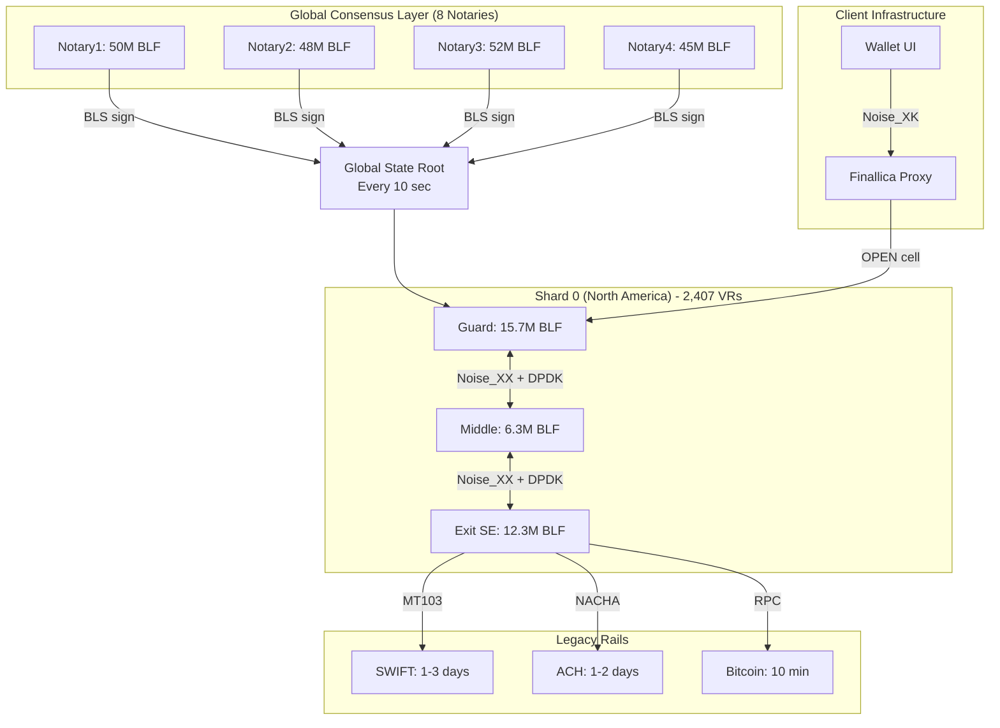
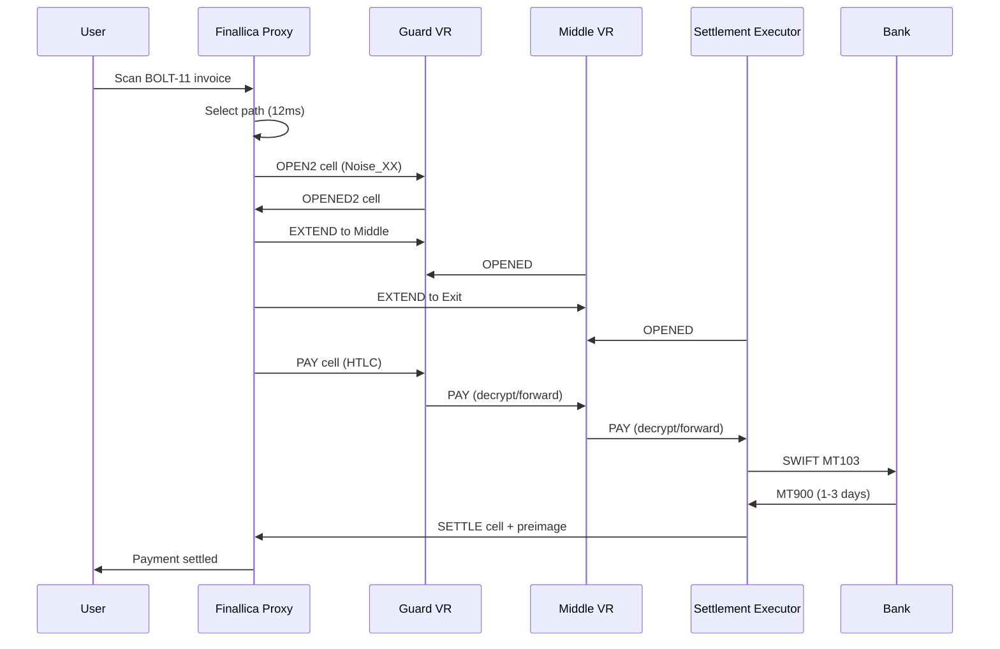

# Finallica: Global Financial Privacy Network

## Executive Summary

**Finallica** is a global, trust-minimized payment overlay network that adapts Tor's anonymity architecture for financial value transfer. It operates as a 127-shard network of ~12,000 Validator-Routers (VRs) processing payments through layered encryption, stake-weighted routing, and BFT consensus.

### Key Characteristics

| Attribute | Value |
|-----------|-------|
| **Network Size** | 12,000 Validator-Routers across 127 jurisdictional shards |
| **Consensus** | HotStuff BFT with 8 notaries, 200ms finality |
| **Cryptography** | BLS12-381 (staking), Noise_XX (handshakes), ChaCha20-Poly1305 (payments) |
| **Throughput** | ~10,000 payments/sec per shard (theoretical) |
| **Settlement** | SWIFT (1-3 days), ACH (1-2 days), Bitcoin (10 min), Lightning (3 sec) |
| **Anonymity Set** | ~1,200 users per payment |
| **Avg Fee** | 0.3% ($0.31 on $100 payment) |
| **Staking Required** | 500K BLF (~$2.25M) for VR, 2M BLF (~$9M) for Settlement Executor |

---

## Quick Concepts

### Core Components

1. **Finallica Proxy (FP)**: Local wallet daemon that handles pathfinding, channel construction, and payment stream multiplexing. Analogous to Tor's Onion Proxy.

2. **Validator-Router (VR)**: Network nodes that forward encrypted payment cells. Three types:
   - **Guard VR**: Entry point (persistent, high-stake)
   - **Middle VR**: Pure forwarding
   - **Settlement Executor (SE)**: Exit node connecting to legacy rails (SWIFT, ACH, BTC)

3. **Consensus Notary**: 8 geo-distributed authorities that sign global state roots every 10 seconds.

4. **Payment Channel**: 3-hop encrypted path (Guard → Middle → Exit) with HTLC-locked funds, valid for 6 hours.

### How a Payment Flows

```
User Scan Invoice → FP Selects Path → Channel Built (Noise_XX) → HTLC Attached → Settlement → Beneficiary Paid
        (12ms)              (247ms p50)              (5ms)          (1-3 days SWIFT)
```

---

## Tor vs Finallica Comparison

| **Tor Concept** | **Finallica Analogue** | **Key Differences** |
|----------------|------------------------|---------------------|
| Onion Router (OR) | Validator-Router (VR) | VRs stake BLF tokens; ORs volunteer |
| Guard Node | Entry VR (persistent) | 90-day persistence vs Tor's variable |
| Middle Node | Middle VR (ephemeral) | Identical forwarding role |
| Exit Node | Settlement Executor (SE) | SE connects to fiat rails; Tor exits to Internet |
| Directory Authority (9) | Consensus Notary (8) | Notaries sign state roots; Dir authorities vote on consensus |
| Circuit (3 hops) | Payment Channel (3 hops) | Channels have HTLC balances; circuits are stateless |
| RELAY cell | PAY cell | Payments include Pedersen commitments |
| AES-128-CTR | ChaCha20-Poly1305 | Different cipher, same layered encryption |
| NTor (X25519) | Noise_XX (X25519) | Similar handshake, Finallica adds BLS stake binding |
| No financial state | HTLC balance table | Channels track locked funds |
| Free to use | 0.3% avg fee | Economic incentives for operators |
| No finality | HotStuff BFT (200ms) | Finallica has settlement finality |

---

## Key Metrics at a Glance

### Network Health (Epoch 18492)
- **Total Payments**: 38.4M per epoch
- **Transaction Value**: $4.27B per epoch
- **Average Payment**: $111.20
- **Estimated Users**: 4.2M daily, 1.8M active wallets
- **Staked Supply**: 18.43M BLF ($82.9B) = 87.8% of total supply

### Performance
- **Channel Build Time**: 127ms (p50), 340ms (p95)
- **Payment RTT**: 580ms average
- **Consensus Finality**: 200ms (4-phase HotStuff)
- **Cell Processing**: 0.8 µs per hop (target)

### Security
- **Guard Compromise Probability**: 0.31% per payment
- **Timing Correlation Success**: 12% (global passive adversary)
- **Anonymity Set**: 1-in-1,200 users
- **Slashing (24h)**: 45,000 BLF ($202K)

---

## Documentation Index

| Document | Description | Points Covered |
|----------|-------------|----------------|
| [ARCHITECTURE_OVERVIEW.md](./ARCHITECTURE_OVERVIEW.md) | 127-shard topology, E2E payment flow | 1-2 |
| [PROTOCOL_SPECIFICATION.md](./PROTOCOL_SPECIFICATION.md) | State machines, cell processing pipeline | 3-4 |
| [PERFORMANCE_ANALYSIS.md](./PERFORMANCE_ANALYSIS.md) | CPU/memory/network bottlenecks | 5 |
| [CRYPTOGRAPHIC_DETAILS.md](./CRYPTOGRAPHIC_DETAILS.md) | Commitment unwrapping, encryption layers | 6 |
| [LIQUIDITY_MANAGEMENT.md](./LIQUIDITY_MANAGEMENT.md) | Flow control, channel windows | 7 |
| [CONSENSUS_MECHANISM.md](./CONSENSUS_MECHANISM.md) | HotStuff BFT, state roots | 8 |
| [SECURITY_ANALYSIS.md](./SECURITY_ANALYSIS.md) | Attack vectors, defenses | 9 |
| [OPERATIONAL_METRICS.md](./OPERATIONAL_METRICS.md) | Live production dashboards | 10 |
| [TOR_FINALLIKA_MAPPING.md](./TOR_FINALLIKA_MAPPING.md) | Complete analogy reference | All |
| [RESEARCH_PROPOSALS.md](./RESEARCH_PROPOSALS.md) | v5.0 roadmap (Fin-340, Fin-N23, Fin-PQ) | Future |
| [CONSTANTS_REFERENCE.md](./CONSTANTS_REFERENCE.md) | All hardcoded values | Reference |

---

## System Architecture Overview



---

## Payment Flow Sequence



---

## Roadmap

### v4.2 (Current)
- BLS12-381 stake attestations
- Noise_XX handshakes
- HotStuff BFT consensus
- Bulletproofs+ range proofs

### v5.0 (2026 - Proposed)
- **Fin-340**: RingCT with MLSAG ring signatures (anonymity: 1,331)
- **Fin-N23**: eBPF flow control (0.3 µs latency, per-stream windows)
- **Fin-PQ**: Post-quantum STARK proofs (quantum-resistant)
- **Fin-Sharding**: Dynamic shard splitting (unlimited TPS)

---

## License & Disclaimer

This is a theoretical architecture specification for educational purposes. Finallica is not a deployed network.

---

*Last Updated: 2024-12-22*
