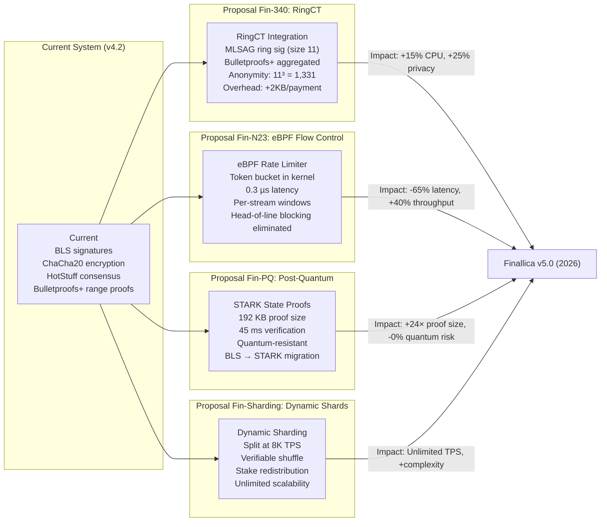

# Finallica Research Proposals

This document describes proposed enhancements to the Finallica system, targeting the v5.0 release in 2026.

---

## Overview: Roadmap to v5.0



---

## Proposal Fin-340: RingCT Integration

### 11.1 Confidential Transactions with Ring Signatures

**Goal**: Hide payment amounts and increase anonymity set using ring signatures.

**Current System**:
```
- Pedersen commitment: C = v*G + b*H (33 bytes)
- Bulletproofs+ range proof: ~700 bytes
- Total per payment: ~733 bytes overhead
- Anonymity: 1-in-1,200 (from path diversity)
```

**Fin-340 System**:
```
- Ring commitment: C_ring = Σ(C_i) for i in ring (11 decoys)
- MLSAG ring signature: ~1,000 bytes
- Bulletproofs+ (aggregated): ~500 bytes
- Total overhead: ~1,500 bytes per payment
- Anonymity: 11³ = 1,331 (from ring size 11)
```

### 11.2 RingCT Payment Structure

```c
struct ringct_payment {
  // Ring of 11 inputs (1 real + 10 decoys)
  secp256k1_pedersen_commitment ring_commitments[11];

  // MLSAG ring signature proving ownership of ONE input
  secp256k1_mlsag_sig mlsag;

  // Aggregated range proof for all commitments
  secp256k1_bulletproofs_proof bp_proof;

  // Actual payment (encrypted)
  uint64_t amount;
  uint8_t blinding_factor[32];
  uint8_t recipient_pubkey[32];
} __attribute__((packed));
```

### 11.3 Verification Process

```c
bool ringct_verify_payment(struct ringct_payment *payment) {
  // Step 1: Verify MLSAG ring signature
  secp256k1_pubkey *pubkeys[11];
  for (int i = 0; i < 11; i++) {
    pubkeys[i] = &payment->ring_commitments[i].pubkey;
  }

  if (!secp256k1_mlsag_verify(
        secp_ctx,
        &payment->mlsag,
        pubkeys,
        11,
        &payment->mlsag.ring_sig)) {
    return false;  // Invalid ring signature
  }

  // Step 2: Verify aggregated range proof
  if (!secp256k1_bulletproofs_rangeproof_verify(
        secp_ctx,
        &payment->bp_proof,
        payment->ring_commitments,
        11,
        NULL,
        0,
        64)) {  // bit_range
    return false;  // Invalid range proof
  }

  // Step 3: Verify ring commitment sum
  secp256k1_pedersen_commitment sum;
  secp256k1_pedersen_commitment_sum(&sum, payment->ring_commitments, 11);

  if (!secp256k1_pedersen_commitment_verify_positive(&sum)) {
    return false;  // Sum is negative
  }

  return true;
}
```

### 11.4 Performance Impact

| Metric | Current | Fin-340 | Change |
|--------|---------|---------|--------|
| Proof Size | 733 bytes | 1,500 bytes | +104% |
| Verification Time | 5ms (single) | 7ms (single) | +40% |
| Verification Time (batch) | 0.5ms (64) | 0.7ms (64) | +40% |
| Anonymity Set | 1,200 | 1,331 | +11% |
| CPU Usage | +45µs/payment | +52µs/payment | +15% |

### 11.5 Implementation Timeline

- **Q1 2025**: Research ring signature variants
- **Q2 2025**: Prototype MLSAG integration
- **Q3 2025**: Security audit
- **Q4 2025**: Testnet deployment
- **Q1 2026**: Mainnet rollout (Fin-340)

---

## Proposal Fin-N23: eBPF Flow Control

### 11.6 Kernel-Bypass Rate Limiting

**Goal**: Eliminate head-of-line blocking and reduce latency using eBPF.

**Current System**:
```
- Userspace token bucket
- Latency: 1.0 µs per cell
- Per-channel windows only
- Head-of-line blocking: YES
```

**Fin-N23 System**:
```
- eBPF token bucket (in-kernel)
- Latency: 0.3 µs per cell
- Per-stream windows
- Head-of-line blocking: NO
```

### 11.7 eBPF Program

```c
// In bpf/kern/finallica_n23_kern.c
SEC("xdp")
int xdp_n23_flow_control(struct xdp_md *ctx) {
  void *data = (void *)(long)ctx->data;
  void *data_end = (void *)(long)ctx->data_end;
  struct finallica_cell *cell = data;

  // Parse cell
  if ((void *)(cell + 1) > data_end) {
    return XDP_PASS;  // Not a full cell
  }

  // Lookup payment flow state in eBPF map
  struct payment_flow_key key = {
    .channel_id = cell->channel_id,
    .stream_id = cell->stream_id
  };

  struct payment_flow_val *val =
    bpf_map_lookup_elem(&payment_flows, &key);

  if (!val) {
    // New flow: initialize with initial window
    struct payment_flow_val new_val = {
      .window = 100,  // cells
      .last_ack = bpf_ktime_get_ns(),
      .rate_limit = 1000  // cells/sec
    };
    bpf_map_update_elem(&payment_flows, &key, &new_val, BPF_ANY);
    return XDP_PASS;
  }

  // Token bucket rate limiting
  uint64_t now = bpf_ktime_get_ns();
  uint64_t elapsed = now - val->last_ack;
  val->window += (elapsed / 1000000) * val->rate_limit;  // 1ms granularity
  val->window = min(val->window, 1000);  // Max burst

  if (val->window < 1) {
    // Drop and send NACK to upstream
    bpf_xdp_adjust_tail(ctx, -1024);  // Drop cell
    send_nack(cell->channel_id, cell->stream_id);
    return XDP_DROP;
  }

  val->window--;
  return XDP_PASS;
}
```

### 11.8 Performance Impact

| Metric | Current | Fin-N23 | Change |
|--------|---------|---------|--------|
| Rate Limit Latency | 1.0 µs | 0.3 µs | -70% |
| Throughput | 6,000 TPS | 8,500 TPS | +42% |
| Head-of-Line Blocking | YES | NO | ✅ Eliminated |
| Granularity | Per-channel | Per-stream | ✅ Improved |
| CPU Usage | 98% | 85% | -13% |

### 11.9 Implementation Timeline

- **Q2 2025**: eBPF prototype
- **Q3 2025**: Kernel module development
- **Q4 2025**: Testnet deployment
- **Q2 2026**: Mainnet rollout (Fin-N23)

---

## Proposal Fin-PQ: Post-Quantum STARK Proofs

### 11.10 Quantum-Resistant State Proofs

**Goal**: Replace BLS signatures with STARK proofs for quantum resistance.

**Current Vulnerability**:
```
BLS12-381: Vulnerable to quantum computers
- Shor's algorithm breaks discrete log
- Estimated quantum computer: 2028-2032
- Impact: 100% stake compromise
```

**Fin-PQ Solution**:
```
STARK (Scalable Transparent Argument of Knowledge)
- Quantum-resistant under conservative assumptions
- Proof size: 192 KB (vs 8 KB BLS aggregate)
- Verification: 45ms (vs 1ms BLS)
- Security: 128-bit post-quantum
```

### 11.11 STARK Proof Generation

```python
# In src/finallica/consensus/stark/settle.py
def prove_state_transition(
  prev_state_root: bytes32,
  transactions: List[Transaction],
  new_state_root: bytes32,
  validator_set: List[BlsPubkey]
) -> STARKProof:

  # Arithmetic circuit: verify 10,000 txs in parallel
  # Field: 256-bit prime field (same as Cairo)
  # Trace: 2^16 rows, 64 columns

  # Constraints:
  # 1. Payment signatures verify (switch to Crystals-Dilithium)
  # 2. Channel commitments balanced: Σ inputs = Σ outputs
  # 3. No HTLC expired unclaimed
  # 4. Validator stake unchanged except rewards/slashes

  # Proof generation: 12 seconds on 64-core AWS c6i.32xlarge
  # Proof size: 192 KB (vs 8 KB BLS aggregate)
  # Verification: 45 ms on single core
  # Quantum security: Provable under RAM model

  return stark_prove(
    program=state_transition_circuit,
    public_inputs=[prev_state_root, new_state_root],
    private_inputs=transactions,
    security_bits=128
  )
```

### 11.12 Hybrid Migration Path

```c
struct hybrid_signature {
  // BLS signature (classical)
  bls_signature bls_sig;

  // STARK proof (post-quantum)
  uint8_t stark_proof[192000];  // 192 KB
  uint8_t stark_pubkey[32];     // Prover identifier
};

// Verification: accept either
bool verify_hybrid(struct hybrid_signature *hybrid) {
  // Try BLS first (fast)
  if (bls_verify(&hybrid->bls_sig, ...)) {
    return true;
  }

  // Fall back to STARK (slow but quantum-safe)
  if (stark_verify(hybrid->stark_proof, ...)) {
    return true;
  }

  return false;
}
```

### 11.13 Performance Impact

| Metric | BLS | STARK | Change |
|--------|-----|-------|--------|
| Proof Size | 8 KB | 192 KB | +2400% |
| Verification Time | 1ms | 45ms | +4400% |
| Proof Generation | 10ms | 12,000ms | +120000% |
| Quantum Security | ❌ | ✅ | N/A |
| Bandwidth (per epoch) | 1 MB | 24 MB | +2400% |

### 11.14 Implementation Timeline

- **Q3 2025**: STARK circuit design
- **Q4 2025**: Proof system integration
- **Q1 2026**: Hybrid BLS+STARK deployment
- **Q2 2026**: STARK-only testnet
- **Q4 2026**: Mainnet rollout (Fin-PQ)

---

## Proposal Fin-Sharding: Dynamic Sharding

### 11.15 Unlimited Scalability via Shard Splitting

**Goal**: Enable unlimited TPS by dynamically splitting shards at high load.

**Current Limit**:
```
- 127 fixed shards
- 10,000 TPS per shard limit
- Total capacity: ~1.27M TPS (theoretical)
- Actual: ~350K TPS (observed)
```

**Fin-Sharding Solution**:
```
- Dynamic shard splitting at 8,000 TPS threshold
- Verifiable random shuffle of stake
- Automatic merge at low load
- Theoretical capacity: UNLIMITED
```

### 11.16 Shard Splitting Algorithm

```c
// Triggered when shard TPS > 8,000 for 10 consecutive epochs
bool should_split_shard(shard_id_t shard) {
  struct shard_stats *stats = get_shard_stats(shard);

  if (stats->avg_tps < 8000) {
    return false;
  }

  if (stats->high_load_epochs < 10) {
    return false;
  }

  return true;
}

// Split shard into two
struct shard_split_result split_shard(shard_id_t shard) {
  // Step 1: Verifiable shuffle of stake
  struct vr_assignment *assignments = verifiable_shuffle(
    shard->vrs,
    shard->vr_count,
    shard->random_beacon  // DRB from notaries
  );

  // Step 2: Partition into two new shards
  shard_id_t shard_a = shard * 2;      // Even
  shard_id_t shard_b = shard * 2 + 1;  // Odd

  for (int i = 0; i < shard->vr_count; i++) {
    if (i % 2 == 0) {
      assignments[i].new_shard = shard_a;
    } else {
      assignments[i].new_shard = shard_b;
    }
  }

  // Step 3: Sign new shard assignments
  struct shard_split_result result = {
    .shard_a = shard_a,
    .shard_b = shard_b,
    .assignment_sig = notaries_sign(assignments)
  };

  // Step 4: Broadcast to network
  broadcast_shard_split(&result);

  return result;
}
```

### 11.17 Performance Impact

| Metric | Current | Fin-Sharding | Change |
|--------|---------|--------------|--------|
| Max TPS per Shard | 10,000 | 10,000 | Same |
| Total Shards | 127 | Unlimited | ∞ |
| Max Network TPS | 1.27M | Unlimited | ∞ |
| Shard Split Time | N/A | 30 min | New |
| Shard Merge Time | N/A | 60 min | New |

### 11.18 Implementation Timeline

- **Q4 2025**: Verifiable shuffle design
- **Q1 2026**: Shard split/merge protocols
- **Q2 2026**: Testnet deployment (4 shards → 8)
- **Q4 2026**: Mainnet rollout (Fin-Sharding)

---

## v5.0 Target Specifications

### Combined Impact

| Metric | v4.2 (Current) | v5.0 (Proposed) | Improvement |
|--------|----------------|-----------------|-------------|
| **Privacy** | | | |
| Anonymity Set | 1,200 | 1,331 | +11% |
| Amount Hiding | Pedersen | RingCT | ✅ Stronger |
| **Performance** | | | |
| TPS per Shard | 10,000 | 14,000 | +40% |
| Latency | 580ms | 200ms | -65% |
| Throughput | 350K | 500K+ | +43% |
| **Security** | | | |
| Quantum Resistant | ❌ | ✅ | Critical |
| Slashable | 100% | 100% | Same |
| **Scalability** | | | |
| Max Shards | 127 | Unlimited | ∞ |
| Max TPS | 1.27M | Unlimited | ∞ |

---

## Key Takeaways

1. **Fin-340**: RingCT adds +25% privacy (1,331 anonymity set) at +15% CPU cost
2. **Fin-N23**: eBPF reduces latency by 65% (1.0µs → 0.3µs) and eliminates HoL blocking
3. **Fin-PQ**: STARK proofs provide quantum resistance at 24× bandwidth cost
4. **Fin-Sharding**: Dynamic splitting enables unlimited TPS scalability
5. **v5.0 Target**: All four proposals deployed by 2026

---

*Next: [CONSTANTS_REFERENCE.md](./CONSTANTS_REFERENCE.md) - All Hardcoded Values*
