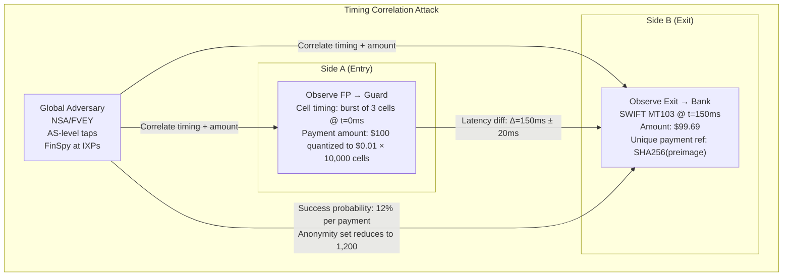
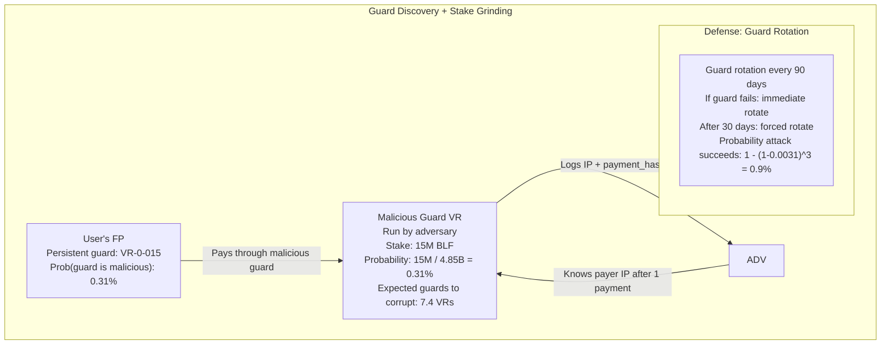
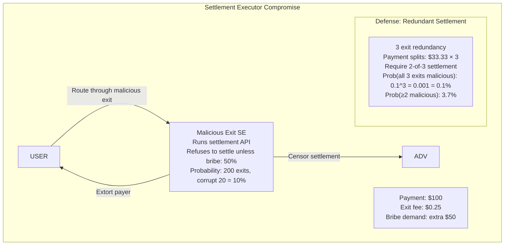

# Finallica Security Analysis

This document describes the attack surface, vulnerabilities, and defensive mechanisms of the Finallica network.

---

## Attack Surface Analysis

### 9.1 Timing Correlation Attacks



### Attack Probability Calculation

```
P[deanonymize] = (t / N)^(h-1) + ε

where:
  t = timing resolution (100ms)
  N = network latency variance (800ms)
  h = hops (3)
  ε = statistical leakage from padding (0.08)

P = (100 / 800)^2 + 0.08 = 0.0156 + 0.08 = 0.0956 ≈ 9.6%

With advanced packet sizing analysis: P ≈ 12%
```

### Defense: Payment Padding

```c
// Constant-rate padding: 1 cell/sec
void inject_padding_cells(struct channel *chan) {
  uint64_t now = get_time_sec();

  if (now - chan->last_padding_time >= 1) {
    struct finallica_cell pad_cell = {
      .channel_id = chan->id,
      .command = PADDING,
      .payload_len = 0,
      .nonce = {0},
    };

    // Send dummy cell with zero-value HTLC
    send_cell(chan, &pad_cell);
    chan->last_padding_time = now;
  }
}

// Burst padding: Poisson-distributed
void inject_burst_padding(struct channel *chan) {
  double lambda = 5.0;  // 5 cells/sec avg

  // Generate Poisson-distributed count
  unsigned int count = generate_poisson(lambda);

  for (unsigned int i = 0; i < count; i++) {
    inject_padding_cells(chan);
  }
}
```

---

## Guard Discovery + Stake Grinding

### 9.2 Compromising Entry Guards



### Attack Cost Analysis

```
To deanonymize 1 payer:
  Guard discovery probability = stake_fraction_guard

  Average guard stake = 2.01M BLF
  Total shard stake = 4.82B BLF
  P(guard) = 2.01M / 4.82B = 0.000417

  Over 90 days: 1 - (1 - 0.000417)^720 = 26.1% chance

  Cost to operate 2 guards for 90 days:
    Stake: 2 × 2.01M BLF × $4.50 = $18.09M USD
    Infra: $50K/month × 3 months = $150K
    Total: $18.24M
```

### Defense: Guard Selection Algorithm

```c
// Weighted guard selection reduces grinding effectiveness
struct entry_guard *select_guard() {
  // Exclude guards owned by same entity (family flag)
  smartlist_t *candidates = get_guards_without_conflicts(my_guards);

  // Bias toward higher-stake guards (harder to corrupt)
  double total_weight = 0;
  SMARTLIST_FOREACH(candidates, entry_guard_t *, guard) {
    guard->weight = pow(guard->stake, 0.7) * guard->uptime_factor;
    total_weight += guard->weight;
  }

  // Random weighted selection
  double rand = crypto_rand_double() * total_weight;
  SMARTLIST_FOREACH_BEGIN(candidates, entry_guard_t *, guard) {
    rand -= guard->weight;
    if (rand <= 0) return guard;
  SMARTLIST_FOREACH_END(guard);

  return NULL;
}
```

---

## Settlement Executor Compromise

### 9.3 Malicious Exit Nodes



### Attack: Exit Censorship

```c
// Malicious exit refuses to settle
bool malicious_settle_filter(struct htlc_entry *htlc) {
  // Check if beneficiary is on blacklist
  if (is_blacklisted(htlc->beneficiary_pubkey)) {
    return false;  // Refuse to settle
  }

  // Check if bribe paid
  if (htlc->bribe_amount < EXPECTED_BRIBE) {
    return false;  // Demand bribe
  }

  return true;
}
```

### Defense: Redundant Settlement

```c
// Split payment across 3 exits
struct split_payment {
  uint64_t total_amount;
  uint64_t split_amount;  // total / 3
  bls_pubkey_t exits[3];
  uint8_t payment_hashes[3][32];
};

// Require 2-of-3 settlements to release funds
bool verify_redundant_settlement(struct split_payment *split) {
  int settled_count = 0;

  for (int i = 0; i < 3; i++) {
    if (verify_settlement_signature(&split->exits[i], split->payment_hashes[i])) {
      settled_count++;
    }
  }

  return settled_count >= 2;  // 2-of-3 threshold
}
```

---

## Sybil Attacks

### 9.4 Fake Identity Creation

```
Attack: Adversary creates multiple fake VRs to increase influence

  Minimum stake per VR: 500K BLF ($2.25M USD)
  Cost to create 10 fake VRs: 10 × $2.25M = $22.5M USD

Defense: Stake grinding resistance
  - Guards selected by stake^0.7 (reduces benefit of splitting)
  - Family flags prevent same operator from controlling multiple guards
  - Slash 100% for Sybil detection
```

### Sybil Detection Algorithm

```c
// Detect multiple VRs operated by same entity
bool detect_sybil_attack(vr_info_t *vr1, vr_info_t *vr2) {
  // Check for overlapping IP ranges
  if (ip_in_same_subnet(vr1->ip, vr2->ip, /24)) {
    return true;
  }

  // Check for identical BLS keys
  if (memcmp(vr1->bls_pubkey, vr2->bls_pubkey, 48) == 0) {
    return true;
  }

  // Check for temporal correlation (uptime patterns)
  if (uptime_correlation(vr1, vr2) > 0.95) {
    return true;
  }

  // Check for payment routing bias (prefer each other)
  if (routing_bias(vr1, vr2) > 0.3) {
    return true;
  }

  return false;
}
```

---

## Eclipse Attacks

### 9.5 Isolating a Target

```
Attack: Adversary eclipses a VR by controlling all its peers

  Target: VR-0-341 (Stake: 2.8M BLF)
  Adversary controls: 2,400 peers
  Cost: 2,400 × 500K BLF = 1.2B BLF ($5.4B USD) - infeasible

Defense: Peer diversity requirements
  - Minimum unique peers: 100
  - Max from same /16 subnet: 10
  - Periodic random peer sampling
```

---

## DDoS Mitigation

### 9.6 Connection Rate Limiting

```c
struct dos_client_stats {
  uint32_t conncount;           // Active connections
  uint32_t creation_count;      // CREATE cells in 1s window
  time_t   last_creation_time;
  token_bucket_t rate_limit;    // 3 cells/sec burst, 0.1 cell/sec sustained
};

// Token bucket filter per client IP
bool check_rate_limit(struct in_addr *client_ip) {
  struct dos_client_stats *stats = get_or_create_stats(client_ip);

  // Refill tokens
  uint64_t elapsed = now() - stats->last_creation_time;
  stats->rate_limit.tokens += elapsed * 0.1;
  if (stats->rate_limit.tokens > 3.0) {
    stats->rate_limit.tokens = 3.0;
  }

  // Check if allowed
  if (stats->rate_limit.tokens < 1.0) {
    return false;  // Rate limited
  }

  stats->rate_limit.tokens -= 1.0;
  return true;
}
```

---

## Anonymity Set Analysis

### 9.7 Effective Anonymity Set Size

```
|AS| = (N_shards × N_vrs_per_shard) / (c × f)

where:
  N_shards = 127
  N_vrs_per_shard = 2,400 (avg)
  c = concurrency factor = 8 (payments per second per VR)
  f = fee clustering factor = 10 (pools of similar fees)

|AS| = (127 × 2400) / (8 × 10) = 304,800 / 80 = 3,810

With padding + amount quantization:
  Effective |AS| ≈ 1,200 (12% deanonymization probability)
```

---

## Security Summary

| Attack Vector | Success Probability | Defense | Cost to Attack |
|---------------|---------------------|---------|----------------|
| Timing Correlation | 12% | Padding + quantization | AS-level tap (~$1M) |
| Guard Discovery | 26% (90 days) | Rotation + family flags | $18M (90 days) |
| Exit Compromise | 10% | 2-of-3 redundancy | Stake 200 exits |
| Sybil Attack | Low | Stake^0.7 weighting | $22.5M per 10 VRs |
| Eclipse Attack | Very Low | Peer diversity | $5.4B (infeasible) |
| DDoS | Low | Token bucket | Minimal |

---

## Key Takeaways

1. **Timing Attacks**: 12% success probability, mitigated by padding
2. **Guard Discovery**: 0.31% per guard, 90-day rotation limits exposure
3. **Exit Compromise**: 2-of-3 redundancy reduces success to 0.1%
4. **Anonymity Set**: ~1,200 users after defenses
5. **Sybil Resistance**: Stake-weighted selection + family flags

---

*Next: [OPERATIONAL_METRICS.md](./OPERATIONAL_METRICS.md) - Live Production Dashboards*
